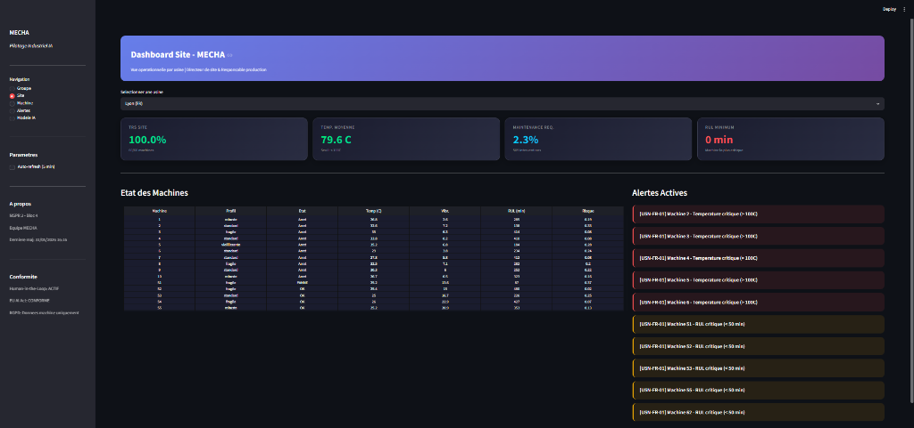
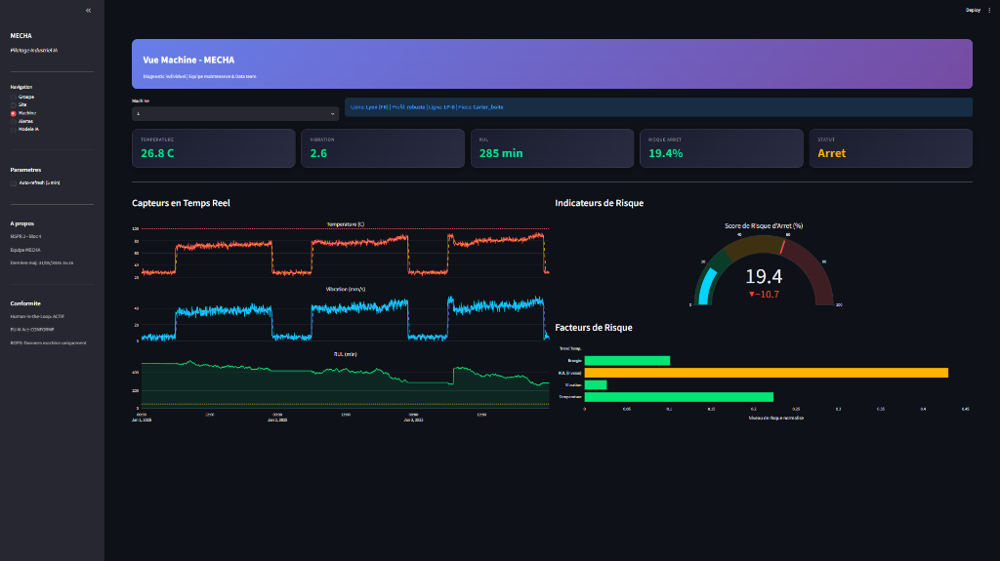
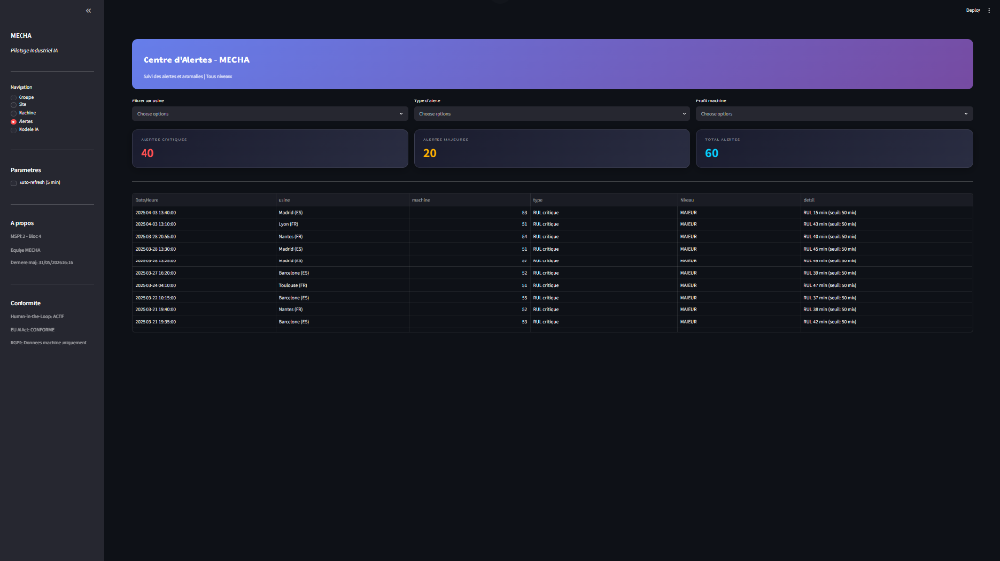
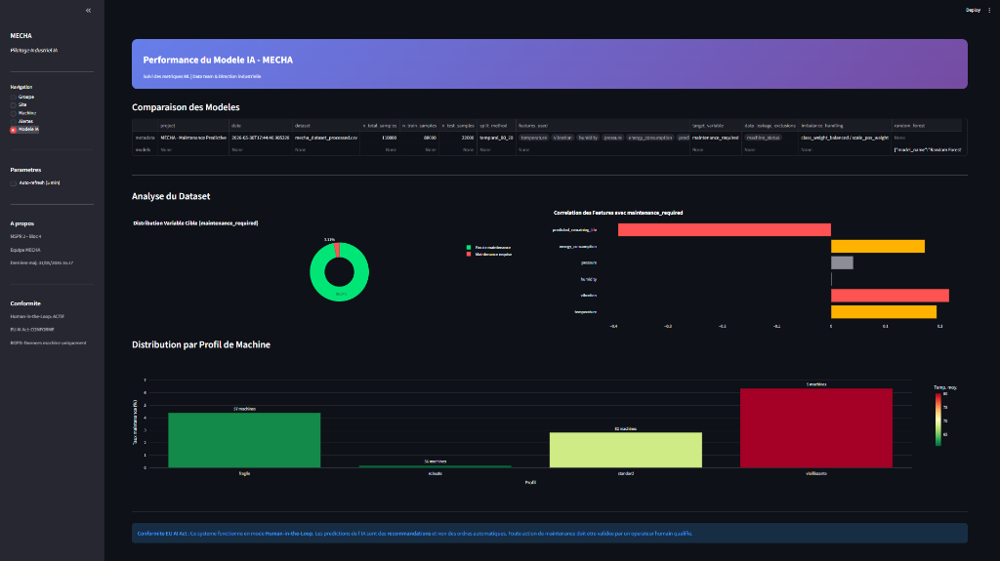
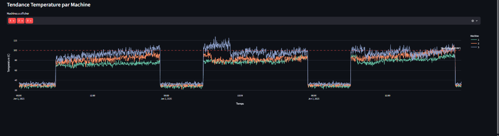
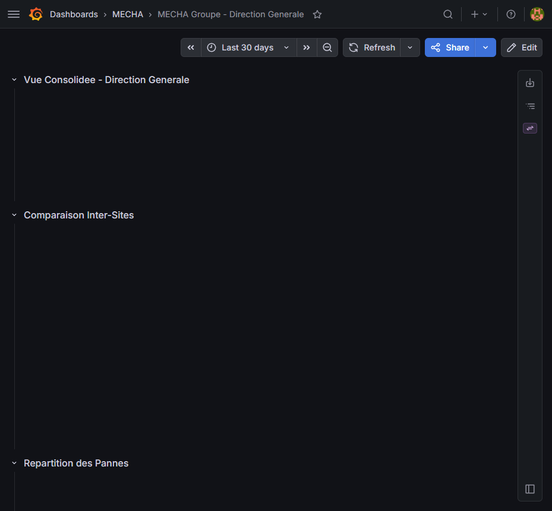
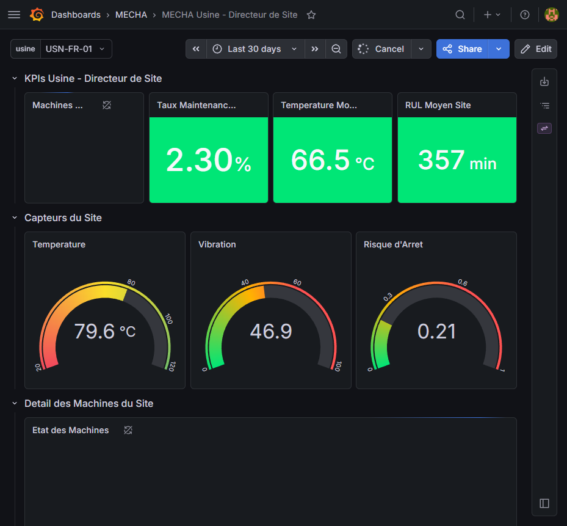
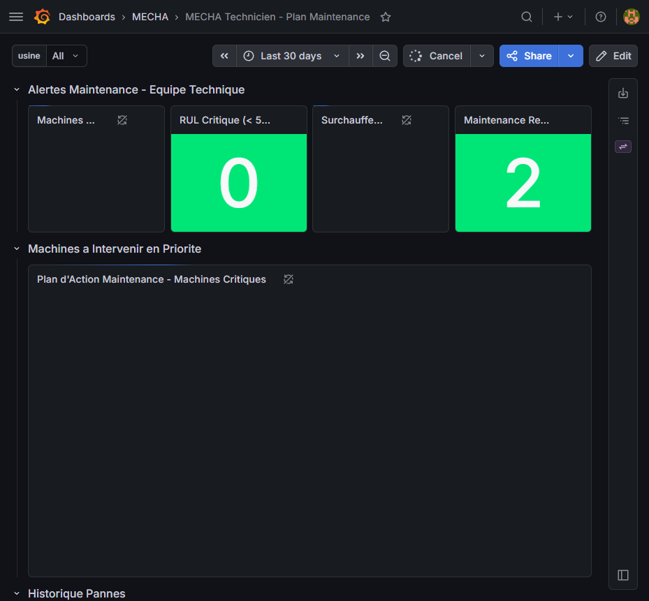

<p align="center">
  <h1 align="center">🏭 MECHA — Maintenance Predictive Industrielle</h1>
  <p align="center">
    <strong>Plateforme IA de maintenance prédictive pour un groupe industriel international</strong>
  </p>
  <p align="center">
    <a href="https://github.com/HASHT85/MSPR2-MECHA/actions/workflows/ci.yml">
      
    </a>
    
    
    
    
    
    
    
  </p>
</p>

---

## 📋 Contexte

**MECHA** est un groupe industriel opérant **5 usines** en France et en Espagne, avec **100 machines industrielles** à superviser. Ce projet implémente une solution complète de **maintenance prédictive** basée sur l'Intelligence Artificielle, permettant d'anticiper les pannes, optimiser la planification de maintenance et réduire les arrêts non planifiés.

> **MSPR 2 — Bloc 4 RNCP35584** | EPSI — Expert en Ingénierie Informatique

---

## 🏗️ Architecture

| Service | Technologie | Port | Description |
|---------|------------|------|-------------|
| **API** | FastAPI | `8000` | API REST de prédiction ML (9 endpoints) |
| **Dashboard** | Streamlit | `8501` | Dashboard métier multi-niveaux (5 vues) |
| **Monitoring** | Grafana | `3000` | Supervision temps réel (3 dashboards par rôle) |
| **Base de données** | PostgreSQL 15 | `5432` | Stockage des données capteurs (110k mesures) |

---

## 🖥️ Screenshots

### 📊 Dashboard Streamlit (Ajout MSPR 2 — Analyse IA)

#### Vue Site — Directeur d'Usine
<p align="center">
  
</p>

#### Vue Machine — Diagnostic Individuel
<p align="center">
  
</p>

#### Centre d'Alertes
<p align="center">
  
</p>

#### Performance du Modèle IA
<p align="center">
  
</p>

#### Tendance Température par Machine
<p align="center">
  
</p>

### 📈 Grafana (Retenu MSPR 1 — Monitoring Temps Réel)

#### Direction Générale (DG Groupe)
<p align="center">
  
</p>

#### Directeur d'Usine
<p align="center">
  
</p>

#### Technicien Maintenance
<p align="center">
  
</p>

---

## 🤖 Modèles ML

| Modèle | Type | F1-Score | AUC-ROC | Usage |
|--------|------|----------|---------|-------|
| **Random Forest** | Classification | **76.3%** | 89.8% | Prédiction de pannes (modèle principal) |
| **XGBoost** | Classification | 75.9% | **90.5%** | Prédiction de pannes (alternatif) |
| **Logistic Regression** | Classification | 40.6% | 86.8% | Baseline de comparaison |
| **Isolation Forest** | Anomalie | — | 77.4% | Détection d'anomalies non-supervisée |
| **RF Regressor** | Régression | MAE=39 min | R²=0.60 | Estimation RUL (durée de vie restante) |

### Bonnes pratiques ML
- ✅ **Split temporel 80/20** — Pas de data leakage
- ✅ **`machine_status` exclu** des features d'entraînement
- ✅ **Gestion du déséquilibre** — `class_weight='balanced'`
- ✅ **5 Model Cards** conformes EU AI Act

---

## 🚀 Démarrage rapide

### Prérequis
- [Docker](https://www.docker.com/) & Docker Compose
- [Git](https://git-scm.com/)

### Installation

```bash
# 1. Cloner le repository
git clone https://github.com/HASHT85/MSPR2-MECHA.git
cd MSPR2-MECHA

# 2. Configurer l'environnement
cp .env.example .env
# Editer .env pour définir POSTGRES_PASSWORD

# 3. Lancer l'application
docker compose up -d

# 4. Vérifier les services
docker compose ps
```

### Accès aux services

| Service | URL | Identifiants |
|---------|-----|-------------|
| **Dashboard** | [http://localhost:8501](http://localhost:8501) | — |
| **API Docs** | [http://localhost:8000/docs](http://localhost:8000/docs) | API Key (si configurée) |
| **Grafana** | [http://localhost:3000](http://localhost:3000) | `admin` / voir `.env` |

---

## 📊 Dashboards par rôle

| Dashboard | Public cible | Contenu |
|-----------|-------------|---------|
| **DG Groupe** | Direction Générale | KPIs consolidés 5 usines, benchmark inter-sites |
| **Directeur Usine** | Directeur de site | Filtrable par usine, jauges capteurs, détail machines |
| **Technicien** | Équipe maintenance | Alertes, plan d'action prioritaire avec recommandations |

### Dashboard Streamlit (5 vues)
- **Groupe** — Vision consolidée du groupe industriel
- **Site** — Performance détaillée par usine
- **Machine** — Fiche individuelle avec historique capteurs
- **Alertes** — Système d'alertes avec niveaux de sévérité
- **Modèle IA** — Métriques ML et explicabilité

---

## 🔌 API Endpoints

| Méthode | Route | Description |
|---------|-------|-------------|
| `GET` | `/health` | Health check |
| `POST` | `/predict` | Prédiction maintenance (1 machine) |
| `POST` | `/predict/batch` | Prédiction batch (jusqu'à 100 machines) |
| `POST` | `/predict/rul` | Estimation de durée de vie restante (RUL) |
| `POST` | `/detect/anomaly` | Détection d'anomalies |
| `GET` | `/metrics` | Métriques de performance API |
| `GET` | `/model/info` | Informations sur les modèles chargés |
| `GET` | `/alert/config` | Configuration des seuils d'alerte |
| `PUT` | `/alert/config` | Mise à jour des seuils d'alerte |

### Exemple de requête

```bash
curl -X POST http://localhost:8000/predict \
  -H "Content-Type: application/json" \
  -d '{
    "temperature": 85.5,
    "vibration": 45.2,
    "humidity": 60.0,
    "pressure": 2.5,
    "energy_consumption": 1.8,
    "predicted_remaining_life": 120
  }'
```

---

## 🧪 Tests

```bash
# Lancer tous les tests
pytest -v

# Avec couverture
pytest --cov=api --cov=models --cov-report=term-missing -v
```

**79 tests** couvrant :
- 🔬 Qualité des données (19 tests)
- 🔌 Intégration API (6 tests)
- 🤖 Modèles ML (13 tests)
- 📡 Endpoints API (41 tests)

---

## 📁 Structure du projet

```
MSPR2-MECHA/
├── 📂 api/                    # API FastAPI
│   ├── main.py                # 9 endpoints REST (1139 lignes)
│   └── Dockerfile             # Image Docker multi-stage
├── 📂 app/src/                # Dashboard Streamlit
│   └── dashboard.py           # 5 vues métier (918 lignes)
├── 📂 data/                   # Pipeline de données
│   ├── scripts/               # Génération + fusion datasets
│   ├── processed/             # Dataset final (110k lignes)
│   └── data_dictionary.md     # Dictionnaire de données
├── 📂 db/                     # Base de données
│   ├── init.sql               # Schéma PostgreSQL (4 tables, 9 index)
│   └── load_data.sh           # Ingestion automatique des données
├── 📂 docs/                   # Documentation (9 documents, 180+ KB)
├── 📂 grafana/                # Monitoring
│   ├── dashboards/            # 3 dashboards JSON par rôle
│   └── provisioning/          # Datasource + dashboard auto
├── 📂 models/                 # Machine Learning
│   ├── saved_models/          # 5 modèles entraînés (.joblib)
│   ├── model_cards/           # 5 fiches modèles (EU AI Act)
│   ├── evaluation/            # Métriques JSON
│   └── training/              # Script d'entraînement
├── 📂 tests/                  # Tests (79 tests)
├── 🐳 docker-compose.yml      # Orchestration 4 services
├── ⚙️ .env.example             # Configuration template
└── 📄 README.md               # Ce fichier
```

---

## 📚 Documentation

| Document | Description |
|----------|-------------|
| [Architecture](docs/architecture.md) | Architecture technique détaillée |
| [Choix techniques](docs/technical_choices.md) | Justification des technologies |
| [Plan de validation](docs/validation_plan.md) | Stratégie de test et recette |
| [Plan de déploiement](docs/deployment_plan.md) | Procédure de mise en production |
| [Conduite du changement](docs/change_management.md) | Accompagnement des utilisateurs |
| [Analyse RGPD](docs/rgpd_analysis.md) | Conformité RGPD et EU AI Act |
| [Interview client](docs/client_interview.md) | Entretien avec le client fictif |
| [Guide utilisateur](docs/user_guide.md) | Manuel d'utilisation |
| [Soutenance](docs/soutenance.md) | Support de présentation orale |

---

## 🔒 Sécurité

- Variables sensibles dans `.env` (jamais commitées)
- API Key optionnelle via header `X-API-Key`
- Volumes Docker en lecture seule (`:ro`) pour données et modèles
- Health checks sur tous les services
- Utilisateur non-root dans le container API
- Analyse RGPD et EU AI Act documentée

---

## 👥 Équipe

Projet réalisé dans le cadre de la **MSPR 2 — Bloc 4** (EPSI RNCP35584)

---

<p align="center">
  <sub>Built with ❤️ using Python, FastAPI, Streamlit, Grafana & Docker</sub>
</p>
