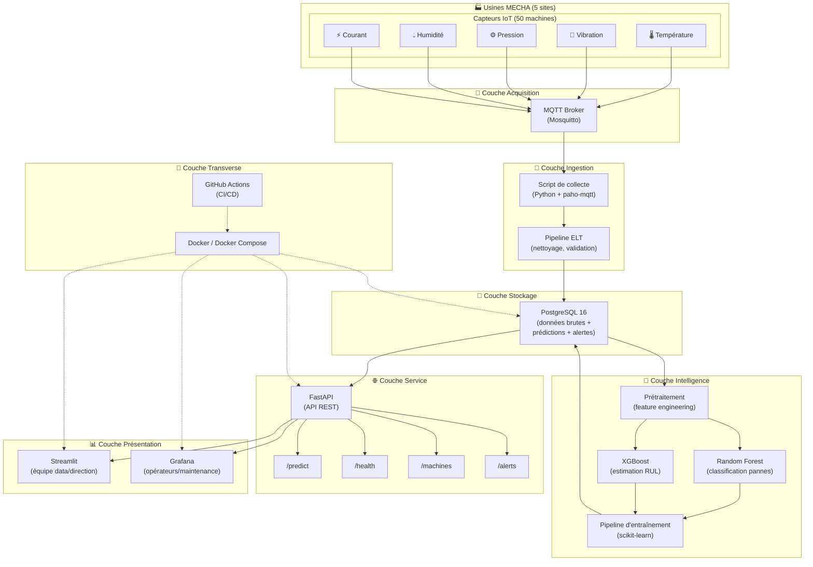
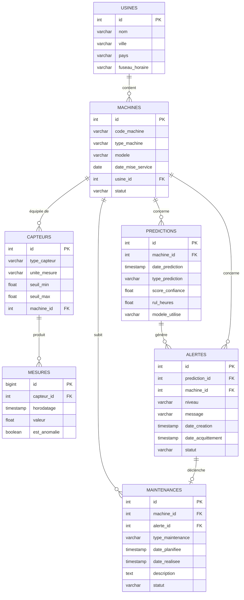
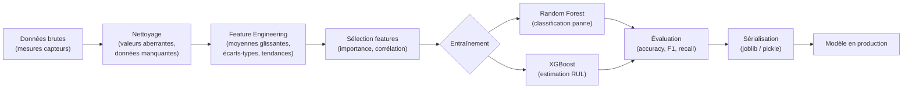
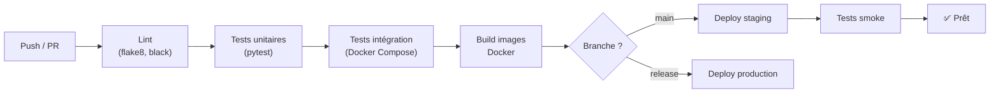
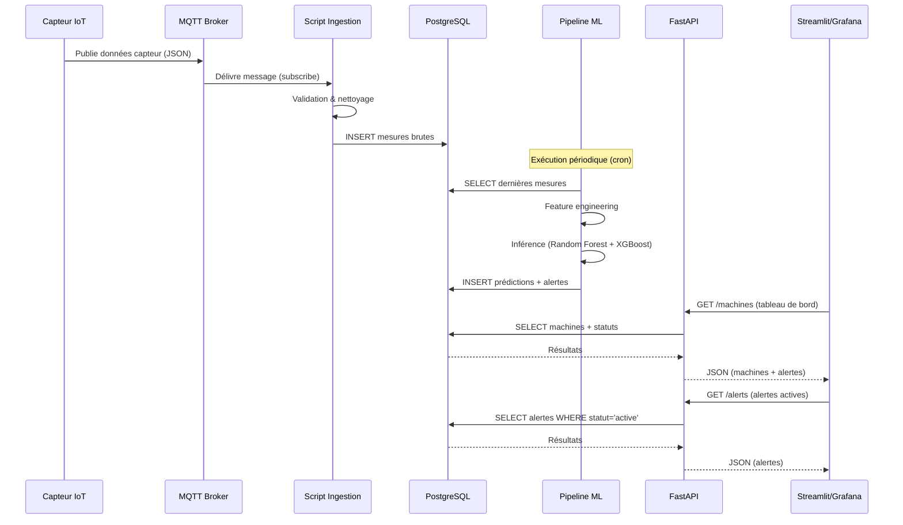
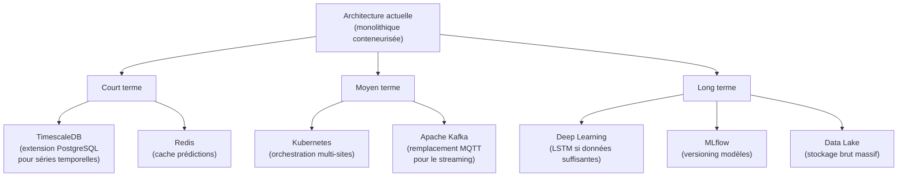

# 🏗️ Architecture Technique — MECHA Predict

> **Projet** : MECHA — Maintenance Prédictive par Intelligence Artificielle  
> **Version** : 1.0  
> **Date** : 30/05/2026  
> **Auteurs** : Malek El Fayedh, Thibaut Doreau, Vincent Gonçalves, Pierre-Louis Guinel  
> **Compétence couverte** : **C2 — Concevoir une architecture applicative**

---

## 1. Introduction

Ce document présente l'architecture technique de la solution **MECHA Predict**, une plateforme de maintenance prédictive basée sur l'intelligence artificielle destinée aux 5 usines du groupe MECHA. L'objectif est de passer d'une maintenance curative coûteuse à une maintenance prédictive optimisée, en exploitant les données des capteurs IoT installés sur les 50 machines de production.

### 1.1 Objectifs de l'architecture

| Objectif | Description |
|----------|-------------|
| **Collecte temps réel** | Ingérer les données de 50 machines (température, vibration, pression, humidité, courant) |
| **Stockage structuré** | Centraliser les données dans une base relationnelle performante |
| **Prédiction IA** | Détecter les anomalies et prédire les pannes avant qu'elles ne surviennent |
| **Visualisation** | Fournir des tableaux de bord adaptés à chaque profil utilisateur |
| **Déploiement** | Assurer un déploiement reproductible et scalable via conteneurisation |
| **Automatisation** | Intégrer un pipeline CI/CD pour garantir la qualité du code |

---

## 2. Vue d'ensemble de l'architecture

L'architecture suit un modèle **en couches** (layered architecture) permettant une séparation claire des responsabilités :

1. **Couche Acquisition** — Capteurs IoT → Broker MQTT
2. **Couche Ingestion** — Scripts Python de collecte et transformation
3. **Couche Stockage** — PostgreSQL (données brutes + prédictions)
4. **Couche Intelligence** — Pipeline ML (prétraitement, entraînement, inférence)
5. **Couche Service** — API REST FastAPI
6. **Couche Présentation** — Streamlit (équipe data) + Grafana (opérateurs)
7. **Couche Transverse** — Docker (conteneurisation) + GitHub Actions (CI/CD)

### 2.1 Diagramme d'architecture globale

---

## 3. Description détaillée des couches

### 3.1 Couche Acquisition — Capteurs IoT & MQTT

**Rôle** : Collecter les données brutes des capteurs en temps réel.

| Élément | Détail |
|---------|--------|
| **Capteurs** | 50 machines × 5 types de capteurs = ~250 flux de données |
| **Protocole** | MQTT (Message Queuing Telemetry Transport) |
| **Broker** | Eclipse Mosquitto (léger, open-source, éprouvé en industrie) |
| **Fréquence** | 1 mesure / seconde par capteur (configurable) |
| **Format** | JSON (`{"machine_id": "LYN-CNC-01", "sensor": "temperature", "value": 72.3, "timestamp": "..."}`) |

**Justification MQTT** : Protocole standard IoT, faible bande passante, fiable même en connectivité dégradée (QoS configurable), nativement pub/sub.

### 3.2 Couche Ingestion — Pipeline ELT

**Rôle** : Transformer et charger les données brutes dans la base.

L'approche **ELT** (Extract-Load-Transform) est privilégiée sur ETL car :
- Les données sont d'abord chargées brutes dans PostgreSQL (traçabilité)
- Les transformations sont appliquées en SQL ou Python en aval
- Permet de conserver les données originales pour audit

| Étape | Outil | Description |
|-------|-------|-------------|
| Extract | paho-mqtt (Python) | Souscription aux topics MQTT |
| Load | psycopg2 / SQLAlchemy | Insertion en base PostgreSQL |
| Transform | pandas / SQL | Nettoyage, validation, feature engineering |

### 3.3 Couche Stockage — PostgreSQL

**Rôle** : Stocker l'ensemble des données de manière structurée et requêtable.

**Justification PostgreSQL** :
- Base relationnelle mature et robuste (30+ ans d'existence)
- Support natif JSON pour les données semi-structurées des capteurs
- Extensible (TimescaleDB pour les séries temporelles si besoin)
- Open-source, sans coût de licence
- Excellentes performances en lecture/écriture
- Conformité ACID pour la fiabilité des transactions

#### Modèle de données

### 3.4 Couche Intelligence — Pipeline ML

**Rôle** : Entraîner les modèles et générer des prédictions.

#### Pipeline de traitement

| Modèle | Rôle | Métriques cibles |
|--------|------|------------------|
| **Random Forest** | Classification binaire (panne imminente oui/non) | Recall ≥ 90%, Precision ≥ 85% |
| **XGBoost** | Régression (estimation RUL en heures) | MAE ≤ 24h, R² ≥ 0.85 |

**Features extraites** :
- Moyennes glissantes (1h, 6h, 24h)
- Écarts-types glissants
- Dérivées (tendance à la hausse/baisse)
- Compteurs de dépassements de seuils
- Ratios inter-capteurs

### 3.5 Couche Service — API FastAPI

**Rôle** : Exposer les fonctionnalités via une API REST.

**Justification FastAPI** :
- Performance élevée (asynchrone, basé sur Starlette/Uvicorn)
- Documentation automatique (Swagger/OpenAPI)
- Validation native des données (Pydantic)
- Typage Python natif
- Idéal pour le prototypage rapide et la production

#### Endpoints principaux

| Endpoint | Méthode | Description | Paramètres |
|----------|---------|-------------|------------|
| `/health` | GET | État de santé de l'API | — |
| `/predict/{machine_id}` | POST | Lancer une prédiction pour une machine | `machine_id`, données capteurs |
| `/machines` | GET | Liste des machines et leur état | `usine_id` (optionnel) |
| `/machines/{id}` | GET | Détail d'une machine | `id` |
| `/alerts` | GET | Liste des alertes actives | `niveau`, `usine_id` (filtres) |
| `/alerts/{id}/acknowledge` | PUT | Acquitter une alerte | `id` |
| `/predictions/history` | GET | Historique des prédictions | `machine_id`, `date_debut`, `date_fin` |
| `/models/status` | GET | État des modèles ML déployés | — |

### 3.6 Couche Présentation — Streamlit & Grafana

#### Streamlit (équipe data / direction)

**Rôle** : Dashboard analytique pour l'exploration des données et le suivi des modèles.

| Fonctionnalité | Description |
|----------------|-------------|
| Vue d'ensemble | KPIs globaux, taux de disponibilité par usine |
| Analyse machine | Historique capteurs, tendances, prédictions |
| Performance modèles | Métriques ML, drift detection |
| Gestion alertes | Tableau des alertes avec filtres et actions |

**Justification Streamlit** : Prototypage rapide en Python pur, parfait pour l'équipe data, interactif, déployable facilement.

#### Grafana (opérateurs / maintenance)

**Rôle** : Monitoring temps réel pour les équipes terrain.

| Fonctionnalité | Description |
|----------------|-------------|
| Dashboards usine | Vue temps réel par site (1 dashboard / usine) |
| Courbes capteurs | Température, vibration, pression en temps réel |
| Alerting natif | Notifications (email, Slack) sur dépassement seuils |
| Historique | Exploration des données passées |

**Justification Grafana** : Standard industriel pour le monitoring, connexion native PostgreSQL, alerting intégré, familier des équipes ops.

### 3.7 Couche Transverse — Docker & CI/CD

#### Docker

Chaque composant est conteneurisé pour garantir la reproductibilité :

| Service | Image | Port |
|---------|-------|------|
| `api` | Python 3.11 + FastAPI | 8000 |
| `streamlit` | Python 3.11 + Streamlit | 8501 |
| `postgres` | PostgreSQL 16 | 5432 |
| `grafana` | Grafana OSS | 3000 |
| `mosquitto` | Eclipse Mosquitto | 1883 |
| `ml-worker` | Python 3.11 + scikit-learn | — |

**Justification Docker** :
- Isolation des services
- Déploiement identique dev/staging/prod
- Scalabilité horizontale possible
- Portabilité entre sites

#### GitHub Actions (CI/CD)

**Justification GitHub Actions** :
- Intégré nativement à GitHub (hébergement du code)
- Gratuit pour les projets open-source
- Configuration YAML simple
- Large écosystème d'actions réutilisables
- Secrets management intégré

---

## 4. Comparatif des choix techniques

### 4.1 Base de données

| Critère | PostgreSQL ✅ | MongoDB | InfluxDB |
|---------|:------------:|:-------:|:--------:|
| Maturité | ⭐⭐⭐⭐⭐ | ⭐⭐⭐⭐ | ⭐⭐⭐ |
| SQL standard | ✅ | ❌ | Partiel (InfluxQL) |
| Séries temporelles | ✅ (TimescaleDB) | ⚠️ | ✅ |
| Relations complexes | ✅ | ❌ | ❌ |
| Support JSON | ✅ (JSONB) | ✅ (natif) | ❌ |
| Coût | Gratuit | Gratuit (Community) | Gratuit (OSS) |
| Écosystème | ⭐⭐⭐⭐⭐ | ⭐⭐⭐⭐ | ⭐⭐⭐ |

### 4.2 Framework API

| Critère | FastAPI ✅ | Flask | Django REST |
|---------|:---------:|:-----:|:-----------:|
| Performance | ⭐⭐⭐⭐⭐ | ⭐⭐⭐ | ⭐⭐⭐ |
| Doc automatique | ✅ (Swagger) | ❌ (manuel) | ✅ (DRF) |
| Asynchrone | ✅ (natif) | ⚠️ (via extension) | ⚠️ |
| Typage / Validation | ✅ (Pydantic) | ❌ | ✅ (Serializers) |
| Courbe d'apprentissage | Faible | Très faible | Moyenne |
| Taille projet | Léger | Léger | Lourd |

### 4.3 Dashboard

| Critère | Streamlit ✅ | Dash | Metabase |
|---------|:-----------:|:----:|:--------:|
| Langage | Python | Python | No-code |
| Prototypage rapide | ⭐⭐⭐⭐⭐ | ⭐⭐⭐ | ⭐⭐⭐⭐ |
| Interactivité | ✅ | ✅ | ⚠️ (limité) |
| Personnalisation | ⭐⭐⭐⭐ | ⭐⭐⭐⭐⭐ | ⭐⭐ |
| Déploiement | Simple | Moyen | Simple |
| Communauté | ⭐⭐⭐⭐ | ⭐⭐⭐ | ⭐⭐⭐ |

### 4.4 Conteneurisation

| Critère | Docker ✅ | VM | Bare Metal |
|---------|:--------:|:--:|:----------:|
| Isolation | ✅ | ✅ | ❌ |
| Légèreté | ⭐⭐⭐⭐⭐ | ⭐⭐ | ⭐⭐⭐⭐⭐ |
| Portabilité | ⭐⭐⭐⭐⭐ | ⭐⭐⭐ | ⭐ |
| Reproductibilité | ⭐⭐⭐⭐⭐ | ⭐⭐⭐ | ⭐ |
| Temps démarrage | Secondes | Minutes | — |
| Coût opérationnel | Faible | Élevé | Moyen |

### 4.5 CI/CD

| Critère | GitHub Actions ✅ | Jenkins | GitLab CI |
|---------|:----------------:|:-------:|:---------:|
| Intégration Git | ✅ (natif GitHub) | Via plugin | ✅ (natif GitLab) |
| Configuration | YAML (simple) | Groovy (complexe) | YAML |
| Maintenance | Aucune (SaaS) | Serveur dédié | Aucune (SaaS) |
| Coût | Gratuit (public) | Gratuit + infra | Gratuit (limité) |
| Écosystème | ⭐⭐⭐⭐⭐ | ⭐⭐⭐⭐⭐ | ⭐⭐⭐⭐ |

---

## 5. Diagramme de séquence — Flux de prédiction

---

## 6. Contraintes et prérequis techniques

### 6.1 Infrastructure réseau

| Prérequis | Détail |
|-----------|--------|
| Connectivité capteurs | Réseau local industriel (Ethernet/Wi-Fi industriel) |
| Bande passante | ≥ 10 Mbps par site (données capteurs + dashboards) |
| Latence | < 500ms capteur → broker MQTT |
| VPN inter-sites | Tunnel sécurisé entre les 5 usines et le serveur central |
| Ports ouverts | 1883 (MQTT), 5432 (PostgreSQL), 8000 (API), 8501 (Streamlit), 3000 (Grafana) |

### 6.2 Serveurs

| Composant | CPU | RAM | Stockage | OS |
|-----------|-----|-----|----------|-----|
| Serveur central (API + ML) | 8 vCPU | 32 Go | 500 Go SSD | Ubuntu 22.04 LTS |
| Serveur BDD | 4 vCPU | 16 Go | 1 To SSD | Ubuntu 22.04 LTS |
| Edge Gateway (par site) | 2 vCPU | 4 Go | 64 Go | Linux embarqué |

---

## 7. Évolutivité et scalabilité

### 7.1 Axes d'évolution

### 7.2 Dimensionnement prévisionnel

| Métrique | Phase pilote (Lyon) | Déploiement complet (5 sites) |
|----------|:-------------------:|:-----------------------------:|
| Machines monitorées | 10 | 50 |
| Mesures / jour | ~864 000 | ~4 320 000 |
| Volume BDD / mois | ~2 Go | ~10 Go |
| Prédictions / jour | ~240 | ~1 200 |
| Utilisateurs simultanés | 5-10 | 30-50 |

---

## 8. Synthèse

L'architecture proposée répond aux exigences du projet MECHA en offrant :

- ✅ **Collecte fiable** des données IoT via MQTT
- ✅ **Stockage structuré** dans PostgreSQL avec un modèle de données adapté
- ✅ **Prédictions pertinentes** grâce aux modèles Random Forest et XGBoost
- ✅ **API moderne** avec FastAPI pour l'interopérabilité
- ✅ **Visualisation adaptée** avec Streamlit (data) et Grafana (terrain)
- ✅ **Déploiement reproductible** via Docker et Docker Compose
- ✅ **Qualité continue** grâce à GitHub Actions

Cette architecture modulaire permet une **évolution progressive** du système sans remise en cause de l'existant, accompagnant ainsi la montée en maturité du programme de maintenance prédictive de MECHA.

---

> **Document validé par** : Équipe projet MECHA  
> **Prochaine révision** : À l'issue de la phase pilote (Lyon)
