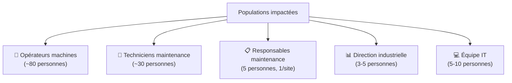
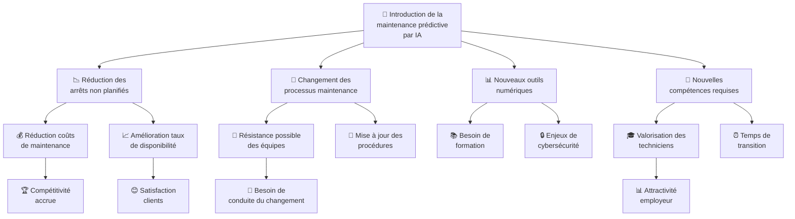
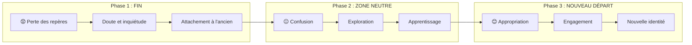
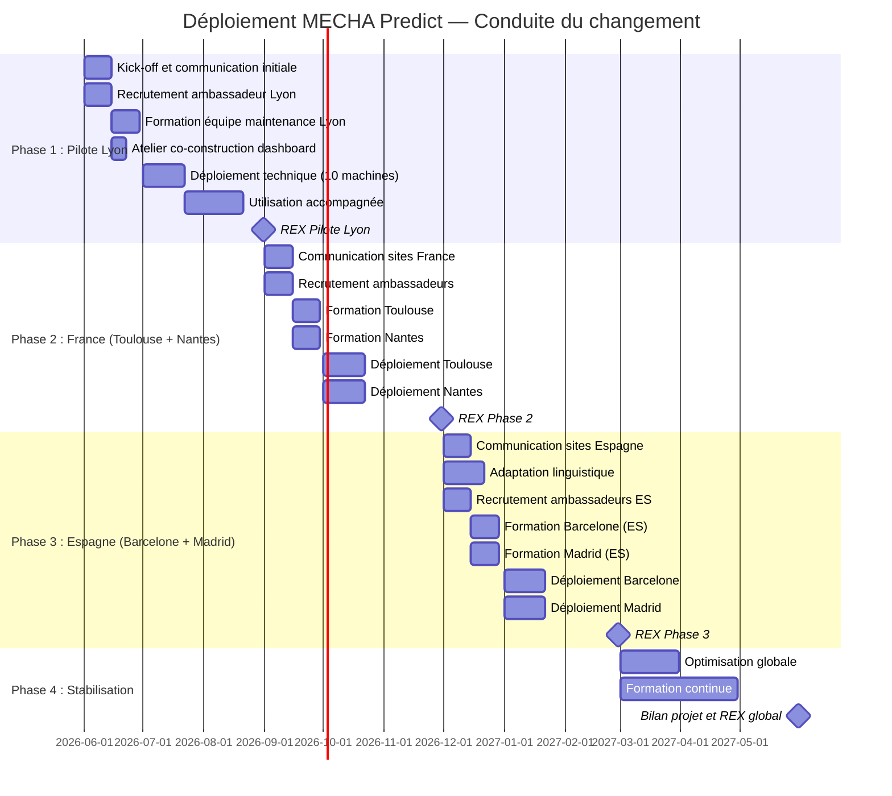
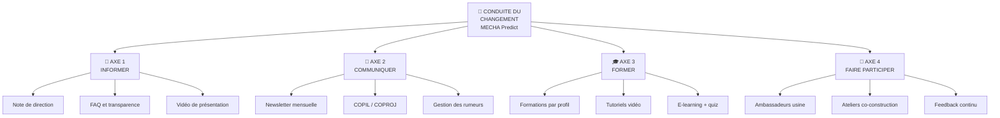

# 🔄 Plan de Conduite du Changement — MECHA Predict

> **Projet** : MECHA — Maintenance Prédictive par Intelligence Artificielle  
> **Version** : 1.0  
> **Date** : 30/05/2026  
> **Auteurs** : Malek El Fayedh, Thibaut Doreau, Vincent Gonçalves, Pierre-Louis Guinel  
> **Compétence couverte** : **C8 — Conduire le changement (4 axes)**

---

## 1. Introduction

### 1.1 Contexte du changement

Le groupe MECHA engage une transformation majeure de ses pratiques de maintenance. Le passage d'une **maintenance curative** (réaction aux pannes) à une **maintenance prédictive** (anticipation des pannes par IA) impacte l'ensemble des 5 sites industriels et leurs équipes.

Ce changement implique :
- L'introduction de **nouveaux outils numériques** (dashboards, alertes IA)
- La **modification des processus** de décision de maintenance
- Le développement de **nouvelles compétences** (interprétation des données)
- Un **changement culturel** : passer de « je répare quand ça casse » à « j'anticipe avant que ça casse »

### 1.2 Enjeux

| Enjeu | Impact |
|-------|--------|
| **Adhésion des équipes** | Sans l'adhésion des opérateurs et techniciens, la solution sera sous-utilisée |
| **Confiance dans l'IA** | Les équipes doivent comprendre et faire confiance aux prédictions |
| **Continuité opérationnelle** | Le changement ne doit pas perturber la production |
| **Retour sur investissement** | L'adoption rapide conditionne les bénéfices du projet |

### 1.3 Risques de résistance identifiés

| Risque | Population | Probabilité | Impact | Mitigation |
|--------|-----------|:-----------:|:------:|-----------|
| Peur du remplacement par l'IA | Opérateurs | Élevée | Élevé | Communication claire : l'IA assiste, ne remplace pas |
| Rejet du changement de routine | Techniciens maintenance | Moyenne | Élevé | Formation progressive, accompagnement terrain |
| Scepticisme sur la fiabilité de l'IA | Responsables maintenance | Moyenne | Moyen | Phase pilote avec résultats prouvés |
| Surcharge de travail perçue | Tous | Moyenne | Moyen | Démontrer le gain de temps |
| Barrière linguistique | Sites espagnols | Faible | Moyen | Interface bilingue, formation en espagnol |

---

## 2. Analyse d'impact du changement

### 2.1 Populations impactées

### 2.2 Matrice d'impact

| Population | Impact sur les outils | Impact sur les processus | Impact sur les compétences | Niveau de changement |
|------------|:--------------------:|:------------------------:|:--------------------------:|:--------------------:|
| **Opérateurs machines** | Faible (consultation alertes) | Moyen (nouveau workflow alerte) | Faible (lecture dashboard) | ⭐⭐ Modéré |
| **Techniciens maintenance** | Élevé (utilisation quotidienne) | Élevé (planification prédictive) | Moyen (interprétation données) | ⭐⭐⭐ Fort |
| **Responsables maintenance** | Élevé (pilotage par dashboard) | Élevé (décision basée sur l'IA) | Élevé (analyse prédictive) | ⭐⭐⭐ Fort |
| **Direction industrielle** | Moyen (reporting) | Faible (supervision) | Faible (vision macro) | ⭐ Faible |
| **Équipe IT** | Élevé (administration) | Moyen (support nouveau système) | Élevé (Docker, ML, API) | ⭐⭐⭐ Fort |

---

## 3. Axe 1 — INFORMER

> **Objectif** : S'assurer que chaque collaborateur comprend le projet, ses objectifs et ce que cela signifie pour lui.

### 3.1 Communication initiale

| Action | Calendrier | Responsable | Support |
|--------|-----------|-------------|---------|
| **Note de direction** | Semaine 1 | Directeur Industriel | Email + affichage usine |
| **Kick-off projet** | Semaine 2 | Chef de projet | Présentation PowerPoint |
| **Vidéo de présentation** (3 min) | Semaine 2 | Équipe projet | Vidéo sur intranet |
| **FAQ initiale** | Semaine 3 | Équipe projet | Document PDF + intranet |

### 3.2 Messages clés par population

| Population | Message clé |
|------------|-------------|
| **Opérateurs** | *« L'IA surveille vos machines 24h/24 pour vous prévenir avant les pannes. Votre expertise reste indispensable pour décider des interventions. Rien ne change dans votre travail quotidien, vous aurez juste un outil en plus pour mieux anticiper. »* |
| **Techniciens maintenance** | *« Vous allez pouvoir planifier vos interventions au lieu de subir les urgences. L'outil vous indique quand intervenir et sur quoi. Vous gardez la main sur les décisions techniques. »* |
| **Responsables maintenance** | *« Vous disposerez d'un tableau de bord complet pour piloter la maintenance de votre site. L'IA vous donne des recommandations, vous décidez de la stratégie. »* |
| **Direction** | *« La maintenance prédictive va réduire les arrêts non planifiés de 30% et les coûts de maintenance de 20%. Le déploiement se fait progressivement avec un pilote à Lyon. »* |

### 3.3 Canaux d'information

| Canal | Fréquence | Cible | Contenu type |
|-------|-----------|-------|-------------|
| **Intranet** | Mise à jour mensuelle | Tous | Actualités projet, FAQ, tutoriels |
| **Affichage usine** | Bi-mensuel | Opérateurs / Techniciens | Infographies, dates clés, témoignages |
| **Email** | Mensuel | Responsables / Direction | Newsletter projet, KPIs |
| **Réunions d'équipe** | Hebdomadaire | Par site | Points d'avancement, questions |

### 3.4 Transparence

> ⚠️ **Point critique** : Il est essentiel de communiquer clairement sur ce que l'IA fait et **ne fait pas**.

| Ce que l'IA fait | Ce que l'IA ne fait pas |
|-------------------|------------------------|
| ✅ Surveille les capteurs en continu | ❌ Ne remplace pas les techniciens |
| ✅ Détecte les signes de dégradation | ❌ Ne décide pas des interventions |
| ✅ Estime le temps avant une panne | ❌ Ne contrôle pas les machines |
| ✅ Recommande des actions | ❌ Ne supprime aucun emploi |
| ✅ Apprend de l'historique | ❌ N'est pas infaillible (besoin du terrain) |

---

## 4. Axe 2 — COMMUNIQUER

> **Objectif** : Maintenir un dialogue continu et bidirectionnel tout au long du projet.

### 4.1 Instances de communication

| Instance | Fréquence | Participants | Objectif |
|----------|-----------|-------------|---------|
| **COPIL** (Comité de Pilotage) | Mensuel | Direction + Chef de projet + Responsables sites | Décisions stratégiques, Go/No-Go |
| **COPROJ** (Comité Projet) | Bi-mensuel | Équipe projet + Ambassadeurs | Avancement technique, arbitrages |
| **Points usine** | Hebdomadaire | Équipe projet + Responsable site + Ambassadeur | Suivi déploiement local, remontées terrain |
| **Stand-up équipe projet** | Quotidien | Malek, Thibaut, Vincent, Pierre-Louis | Synchronisation technique |

### 4.2 Newsletter mensuelle « MECHA Predict News »

Structure type :
1. **Chiffre du mois** — un KPI marquant (ex : « 12 pannes évitées ce mois à Lyon »)
2. **Avancement** — état du déploiement (quelle phase, quel site)
3. **Témoignage** — verbatim d'un utilisateur (responsable, technicien)
4. **FAQ** — réponses aux questions remontées du terrain
5. **Agenda** — prochaines dates clés (formations, déploiements)

### 4.3 Gestion des rumeurs et inquiétudes

| Rumeur / Inquiétude | Réponse |
|---------------------|---------|
| *« L'IA va supprimer des postes »* | Non. L'objectif est de réduire les urgences, pas les effectifs. Les techniciens sont plus valorisés avec ce système. |
| *« Si la prédiction est mauvaise, c'est ma faute »* | Non. L'IA est un outil d'aide. La responsabilité est collective et le système s'améliore avec le temps. |
| *« C'est un gadget de plus qui ne marchera pas »* | Le pilote à Lyon a démontré des résultats concrets (données à l'appui). |
| *« On n'a pas été consultés »* | Les ambassadeurs usine participent activement à la conception. Des ateliers de co-construction sont prévus. |

---

## 5. Axe 3 — FORMER

> **Objectif** : Donner à chaque collaborateur les compétences nécessaires pour utiliser efficacement la solution.

### 5.1 Plan de formation par profil

| Profil | Module | Durée | Format | Contenu |
|--------|--------|-------|--------|---------|
| **Opérateurs** | Prise en main | 1h | Présentiel (en usine) | Lire les alertes, code couleur, qui contacter |
| **Techniciens maintenance** | Utilisation avancée | 4h (2×2h) | Présentiel + e-learning | Dashboard, prédictions, RUL, planification maintenance |
| **Responsables maintenance** | Pilotage et décision | 4h (2×2h) | Présentiel | Interprétation KPIs, prise de décision, reporting |
| **Direction** | Vision stratégique | 1h | Visioconférence | ROI, KPIs macro, roadmap évolution |
| **Équipe IT** | Administration système | 8h (2 jours) | Présentiel + TP | Docker, API, BDD, monitoring, dépannage |

### 5.2 Supports de formation

| Support | Description | Disponibilité |
|---------|-------------|--------------|
| **Guide utilisateur** | Document PDF / en ligne (cf. `user_guide.md`) | Intranet + impression |
| **Tutoriels vidéo** | 5 vidéos courtes (2-5 min chacune) | Intranet + YouTube interne |
| **Fiches réflexes** | Cartes plastifiées A5 pour les postes de travail | Distribution en usine |
| **E-learning** | Module interactif avec quiz de validation | Plateforme LMS |
| **Sandbox** | Environnement de test avec données fictives | Accès web |

### 5.3 Contenu des tutoriels vidéo

| N° | Titre | Durée | Contenu |
|----|-------|-------|---------|
| 1 | « Se connecter et naviguer » | 2 min | Connexion, page d'accueil, navigation |
| 2 | « Comprendre les couleurs et les alertes » | 3 min | Code couleur, types d'alertes, actions |
| 3 | « Lire une prédiction » | 3 min | Score de santé, RUL, confiance |
| 4 | « Planifier une maintenance » | 2 min | Créer un ordre, prioriser |
| 5 | « Signaler un problème » | 2 min | Fausse alerte, capteur HS, feedback |

### 5.4 Évaluation des compétences

| Critère | Méthode | Seuil de validation |
|---------|---------|:-------------------:|
| Navigation dans l'interface | Quiz en ligne (10 questions) | ≥ 80% |
| Interprétation d'une alerte | Mise en situation (cas pratique) | Réponse correcte |
| Planification d'une maintenance | Exercice guidé sur sandbox | Réalisation sans aide |
| Signalement d'un problème | Exercice pratique | Procédure respectée |

### 5.5 Formation continue

- **Webinaires trimestriels** : nouveautés, retours d'expérience, questions/réponses
- **Base de connaissances** : FAQ enrichie en continu par les retours terrain
- **Support de proximité** : Ambassadeurs usine disponibles pour aider au quotidien

---

## 6. Axe 4 — FAIRE PARTICIPER

> **Objectif** : Impliquer les collaborateurs dans la conception et l'amélioration de la solution.

### 6.1 Réseau d'ambassadeurs usine

Chaque site dispose de **1 à 2 ambassadeurs** : des collaborateurs volontaires, reconnus par leurs pairs, qui servent de relais entre l'équipe projet et le terrain.

| Site | Ambassadeur(s) | Profil | Rôle |
|------|----------------|--------|------|
| Lyon | À recruter (pilote) | Technicien maintenance senior | Testeur prioritaire, remontée terrain |
| Toulouse | À recruter | Responsable équipe ou technicien | Relais local, accompagnement pairs |
| Nantes | À recruter | Technicien ou opérateur expérimenté | Relais local, retours d'expérience |
| Barcelone | À recruter | Technicien bilingue FR/ES | Traduction culturelle et linguistique |
| Madrid | À recruter | Technicien bilingue FR/ES | Traduction culturelle et linguistique |

**Avantages pour les ambassadeurs** :
- Accès anticipé aux nouvelles fonctionnalités
- Participation aux comités projet (visibilité)
- Valorisation (reconnaissance par la direction)
- Montée en compétences (formation avancée)

### 6.2 Ateliers de co-construction

| Atelier | Objectif | Participants | Calendrier |
|---------|----------|-------------|-----------|
| « Mon dashboard idéal » | Définir les indicateurs clés avec les utilisateurs | Responsables maintenance + techniciens | Phase pilote (mois 1) |
| « Mes seuils d'alerte » | Calibrer les seuils avec l'expertise terrain | Techniciens + équipe data | Phase pilote (mois 2) |
| « Mes processus de maintenance » | Adapter les workflows au nouvel outil | Responsables maintenance | Phase pilote (mois 2) |
| « Bilan pilote » | Retour d'expérience collectif | Tous participants Lyon | Fin phase pilote (mois 3) |

### 6.3 Feedback continu

| Canal de feedback | Description | Fréquence |
|-------------------|-------------|-----------|
| **Bouton feedback** (in-app) | Bouton directement sur l'interface pour signaler un problème ou une suggestion | Continu |
| **Boîte à idées** | Boîte physique dans chaque usine + formulaire en ligne | Relevé bi-mensuel |
| **Enquête satisfaction** | Questionnaire court (5 min) sur l'utilisation | Trimestrielle |
| **Entretiens individuels** | Discussion avec les ambassadeurs et utilisateurs clés | Mensuel |

### 6.4 Retours d'expérience (REX)

À chaque fin de phase de déploiement, un **REX** est organisé :

| Élément | Détail |
|---------|--------|
| **Format** | Réunion de 2h, en présentiel |
| **Participants** | Ambassadeurs + responsable site + équipe projet |
| **Méthode** | Tour de table + post-its (ce qui a fonctionné / à améliorer / suggestions) |
| **Livrable** | Compte-rendu diffusé à toutes les parties prenantes |
| **Action** | Plan d'amélioration intégré à la phase suivante |

---

## 7. Outils et modèles de référence

### 7.1 FutureWheel — Anticipation des impacts

Le **FutureWheel** est un outil de prospective qui permet d'anticiper les conséquences d'un changement en cercles concentriques (impacts directs → impacts indirects → impacts lointains).

### 7.2 Modèle transactionnel de William Bridge

Le modèle de **William Bridge** décrit les trois phases psychologiques que traversent les individus lors d'un changement.

#### Application au projet MECHA

| Phase Bridge | Période | Manifestations attendues | Actions d'accompagnement |
|-------------|---------|------------------------|------------------------|
| **FIN** | Mois 1-2 | Perte des repères (« avant on faisait comme ça »), inquiétude sur la fiabilité de l'IA, nostalgie du mode curatif | Reconnaître le passé, valoriser l'expertise acquise, communiquer avec empathie |
| **ZONE NEUTRE** | Mois 3-5 | Confusion sur les nouveaux processus, hésitation entre ancien et nouveau mode, erreurs d'utilisation | Formation active, support renforcé, ambassadeurs de proximité, patience |
| **NOUVEAU DÉPART** | Mois 6+ | Appropriation de l'outil, fierté des résultats, propositions d'amélioration | Valoriser les succès, partager les résultats, intégrer les retours |

---

## 8. Planning de déploiement progressif

### 8.1 Vue d'ensemble

### 8.2 Détail par phase

| Phase | Période | Sites | Machines | Objectif |
|-------|---------|-------|:--------:|---------|
| **Phase 1** — Pilote | Mois 1-3 | Lyon | 10 | Valider la solution et la méthode de conduite du changement |
| **Phase 2** — Extension France | Mois 4-6 | Toulouse, Nantes | 20 | Répliquer en capitalisant sur le REX de Lyon |
| **Phase 3** — International | Mois 7-9 | Barcelone, Madrid | 20 | Adapter au contexte international (langue, culture) |
| **Phase 4** — Stabilisation | Mois 10-12 | Tous | 50 | Optimiser, former en continu, pérenniser |

---

## 9. Indicateurs de suivi du changement (KPIs)

### 9.1 KPIs d'adoption

| Indicateur | Cible Phase 1 | Cible Phase 4 | Source |
|------------|:------------:|:------------:|--------|
| Taux de connexion au dashboard | ≥ 60% des utilisateurs/semaine | ≥ 90% | Logs applicatifs |
| Taux de formation complétée | 100% équipe Lyon | 100% tous sites | LMS |
| Taux de validation quiz | ≥ 80% de réussite | ≥ 90% | LMS |
| Nb alertes consultées / générées | ≥ 70% | ≥ 95% | Application |
| Nb maintenances planifiées via l'outil | ≥ 30% | ≥ 80% | Application |

### 9.2 KPIs de satisfaction

| Indicateur | Cible | Fréquence | Source |
|------------|:-----:|-----------|--------|
| Score de satisfaction utilisateur (NPS) | ≥ 7/10 | Trimestriel | Enquête |
| Taux de réponse aux enquêtes | ≥ 50% | Trimestriel | Enquête |
| Nombre de suggestions reçues | ≥ 5 / mois | Mensuel | Boîte à idées |
| Nombre de problèmes signalés | Tendance ↘ | Mensuel | Feedback in-app |

### 9.3 KPIs métier (impact du changement)

| Indicateur | Baseline (avant) | Cible (après 12 mois) |
|------------|:----------------:|:---------------------:|
| Arrêts non planifiés / mois | ~15 | ≤ 5 (-66%) |
| Coût de maintenance / machine | 100% (référence) | ≤ 80% (-20%) |
| Taux de disponibilité machines | ~88% | ≥ 95% |
| Délai moyen de réaction à une alerte | > 4h | < 1h |

---

## 10. Gestion des résistances

### 10.1 Matrice des résistances et réponses

| Type de résistance | Profil type | Signal d'alerte | Réponse |
|-------------------|-------------|-----------------|---------|
| **Déni** | « Ça ne marchera jamais ici » | Non-connexion au dashboard, remarques négatives | Montrer les résultats concrets du pilote, témoignages de pairs |
| **Colère** | « On ne nous a pas demandé notre avis » | Plaintes formelles, refus de formation | Écoute active, ateliers de co-construction, reconnaissance de l'expertise |
| **Marchandage** | « Je veux bien, mais seulement si... » | Conditions, demandes de compensation | Négociation, intégration raisonnable des demandes |
| **Dépression** | « C'est trop compliqué pour moi » | Retrait, baisse de motivation | Formation individualisée, tutorat par ambassadeur, valorisation |
| **Acceptation** | « Bon, on essaie » | Utilisation progressive, questions constructives | Encouragement, reconnaissance, responsabilisation |

### 10.2 Dispositif d'écoute

- **Ligne d'écoute dédiée** : Un numéro / email pour remonter les difficultés en confidentialité
- **Entretiens ambassadeurs** : Relevé hebdomadaire des signaux faibles
- **Baromètre social** : Enquête flash (3 questions) bi-mensuelle en phase de déploiement

---

## 11. Synthèse des 4 axes

---

> **Document validé par** : Équipe projet MECHA  
> **Prochaine révision** : Après le REX de la Phase 1 (pilote Lyon)
