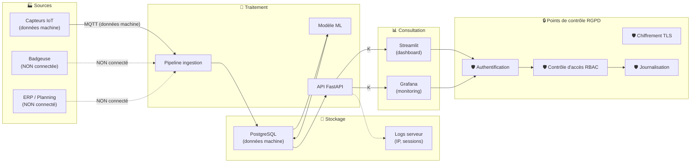
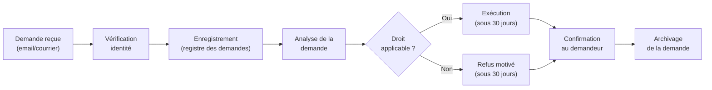
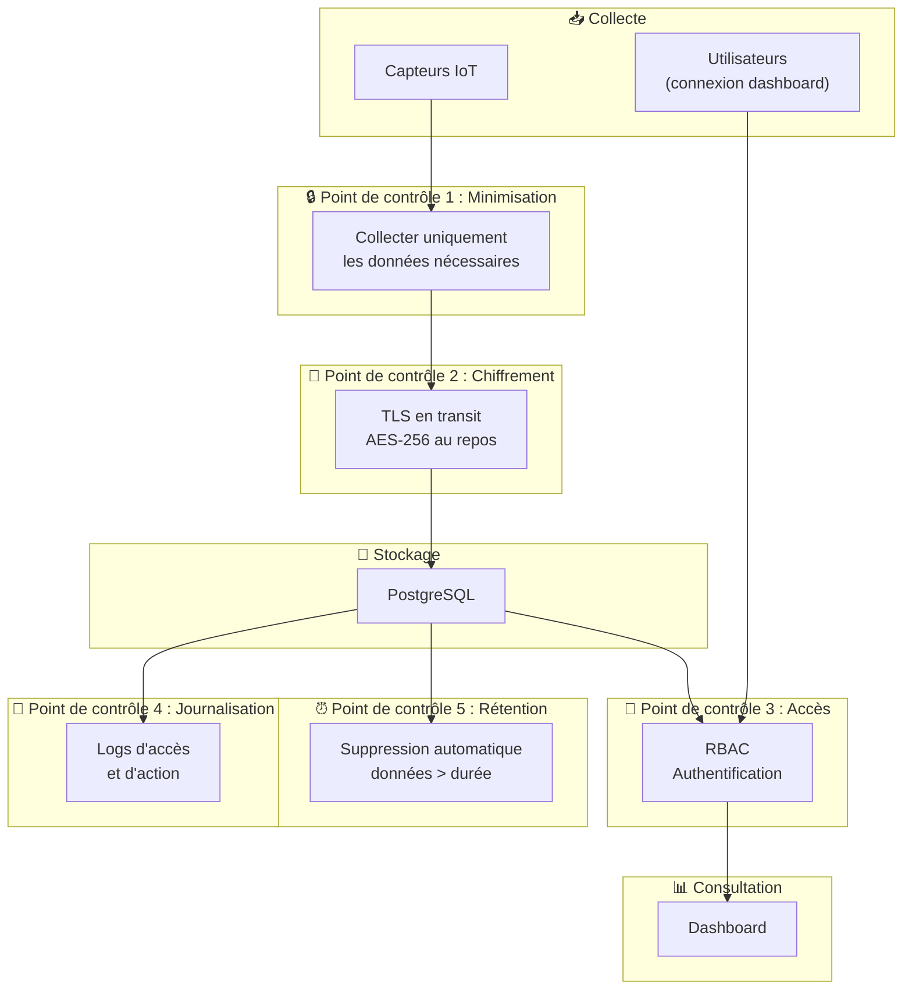

# 🔒 Analyse RGPD — MECHA Predict

> **Projet** : MECHA — Maintenance Prédictive par Intelligence Artificielle  
> **Version** : 1.0  
> **Date** : 30/05/2026  
> **Auteurs** : Malek El Fayedh, Thibaut Doreau, Vincent Gonçalves, Pierre-Louis Guinel  
> **Classification** : Confidentiel

---

## 1. Introduction et cadre juridique

### 1.1 Objet du document

Ce document analyse la conformité de la solution MECHA Predict au regard de la réglementation sur la protection des données personnelles. Il identifie les types de données traitées, évalue la nécessité d'une Analyse d'Impact relative à la Protection des Données (AIPD/PIA), et propose les mesures de protection appropriées.

### 1.2 Textes de référence

| Texte | Champ d'application | Pertinence projet |
|-------|---------------------|------------------|
| **RGPD** (Règlement UE 2016/679) | Union Européenne | Applicable — traitement de données en France et Espagne |
| **Loi Informatique et Libertés** (Loi n°78-17 modifiée) | France | Applicable — 3 sites en France |
| **LOPDGDD** (Ley Orgánica 3/2018) | Espagne | Applicable — 2 sites en Espagne |
| **Directive NIS 2** (2022/2555) | UE — secteurs critiques | Potentiellement applicable (industrie manufacturière) |

### 1.3 Autorités de contrôle

| Pays | Autorité | Rôle |
|------|----------|------|
| France 🇫🇷 | **CNIL** (Commission Nationale de l'Informatique et des Libertés) | Contrôle et sanctions RGPD |
| Espagne 🇪🇸 | **AEPD** (Agencia Española de Protección de Datos) | Contrôle et sanctions LOPDGDD |

---

## 2. Cartographie des données traitées

### 2.1 Données machine (non personnelles)

| Type de donnée | Source | Nature | Base légale | Durée de conservation |
|---------------|--------|:------:|-------------|:---------------------:|
| Température machine | Capteur IoT | ✅ Non personnelle | Intérêt légitime | 2 ans |
| Vibration machine | Capteur IoT | ✅ Non personnelle | Intérêt légitime | 2 ans |
| Pression machine | Capteur IoT | ✅ Non personnelle | Intérêt légitime | 2 ans |
| Courant électrique | Capteur IoT | ✅ Non personnelle | Intérêt légitime | 2 ans |
| Humidité ambiante | Capteur IoT | ✅ Non personnelle | Intérêt légitime | 2 ans |
| Identifiant machine | Configuration | ✅ Non personnelle | Intérêt légitime | Durée de vie machine |
| Historique de maintenance | Saisie manuelle | ✅ Non personnelle | Intérêt légitime | 5 ans |
| Prédictions IA | Modèle ML | ✅ Non personnelle | Intérêt légitime | 2 ans |
| Alertes générées | Système | ✅ Non personnelle | Intérêt légitime | 2 ans |

### 2.2 Données potentiellement personnelles (si collectées)

| Type de donnée | Source potentielle | Nature | Risque | Actuellement collectée ? |
|---------------|-------------------|:------:|:------:|:------------------------:|
| Badge opérateur | Système de badgeage | ⚠️ **Personnelle** | Identification directe | ❌ Non |
| Identifiant de session | Logs applicatifs | ⚠️ **Personnelle** | Identification indirecte | ⚠️ Partiellement |
| Planning des shifts | RH / ERP | ⚠️ **Personnelle** | Lien opérateur-machine | ❌ Non |
| Nom du technicien (intervention) | Fiche maintenance | ⚠️ **Personnelle** | Identification directe | ❌ Non |
| Adresse IP | Logs serveur | ⚠️ **Personnelle** | Identification indirecte | ✅ Oui (logs techniques) |
| Email (notifications) | Configuration alertes | ⚠️ **Personnelle** | Identification directe | ✅ Oui (responsables) |

### 2.3 Flux de données

---

## 3. Analyse : PIA nécessaire ou non ?

### 3.1 Configuration actuelle — Données machine uniquement

Dans sa configuration actuelle, MECHA Predict traite **exclusivement des données machine** (température, vibration, pression, courant, humidité). Ces données ne sont pas des données à caractère personnel au sens du RGPD.

#### Critères d'obligation de PIA (article 35 RGPD)

| Critère CNIL | Applicable ? | Justification |
|-------------|:------------:|--------------|
| Évaluation systématique de personnes | ❌ Non | Pas d'évaluation de personnes, uniquement de machines |
| Traitement à grande échelle de données sensibles | ❌ Non | Données non personnelles |
| Surveillance systématique à grande échelle | ❌ Non | Surveillance de machines, pas de personnes |
| Croisement de données | ❌ Non | Pas de croisement avec des données personnelles |
| Personnes vulnérables | ❌ Non | Pas de traitement de données de personnes vulnérables |
| Usage innovant de technologies | ⚠️ Partiellement | IA prédictive, mais sur données machine |
| Exclusion de bénéfice | ❌ Non | Pas de décision automatisée affectant des personnes |

> ✅ **Conclusion** : Dans la configuration actuelle (données machine uniquement), **une PIA n'est pas nécessaire**. Cependant, des mesures de base de protection des données doivent être maintenues pour les données techniques (logs, emails de notification).

#### Données minimales personnelles traitées

Même sans PIA, MECHA Predict traite a minima :
- **Adresses email** des responsables maintenance (notifications d'alerte)
- **Adresses IP** dans les logs serveur
- **Identifiants de connexion** (login/mot de passe)

Ces traitements sont couverts par l'**intérêt légitime** de l'employeur et nécessitent une mention dans le **registre des traitements**.

### 3.2 Point d'attention — Logs applicatifs

| Type de log | Contient des données personnelles ? | Mesure |
|-------------|:----------------------------------:|--------|
| Logs d'accès (qui s'est connecté, quand) | ⚠️ Oui (identifiant + IP) | Conservation 6 mois max, accès restreint |
| Logs d'action (qui a acquitté une alerte) | ⚠️ Oui (identifiant utilisateur) | Conservation 1 an (traçabilité qualité) |
| Logs techniques (erreurs, performances) | ✅ Non | Conservation standard |

---

## 4. Scénario avec données opérateurs

### 4.1 Contexte hypothétique

Si MECHA décidait d'enrichir la solution en intégrant des données opérateurs pour, par exemple :
- Corréler les pannes avec les équipes/shifts
- Identifier les pratiques d'utilisation machine par opérateur
- Optimiser l'affectation des opérateurs aux machines

Les données suivantes seraient alors collectées :

| Donnée | Type (RGPD) | Finalité | Sensibilité |
|--------|-------------|----------|:-----------:|
| Badge opérateur (identifiant) | Donnée personnelle directe | Lien opérateur-machine | Moyenne |
| Nom / prénom opérateur | Donnée personnelle directe | Identification | Moyenne |
| Planning shifts | Donnée personnelle indirecte | Corrélation temporelle | Faible |
| Temps d'utilisation machine | Donnée personnelle indirecte | Performance opérateur | ⚠️ Élevée |
| Historique d'incidents par opérateur | Donnée personnelle indirecte | Corrélation panne-opérateur | ⚠️ Élevée |

### 4.2 PIA — Analyse d'Impact (simulée)

Dans ce scénario, une **PIA serait obligatoire** car le traitement remplit plusieurs critères de l'article 35 :

| Critère | Applicable | Justification |
|---------|:----------:|--------------|
| Évaluation systématique de personnes | ✅ Oui | Évaluation implicite des pratiques des opérateurs |
| Surveillance systématique | ✅ Oui | Surveillance continue via capteurs liés aux opérateurs |
| Grande échelle | ✅ Oui | ~80 opérateurs sur 5 sites |
| Usage innovant | ✅ Oui | IA prédictive appliquée à des données comportementales |

#### Analyse des risques pour les personnes

| Risque | Probabilité | Gravité | Niveau |
|--------|:-----------:|:-------:|:------:|
| Surveillance perçue des opérateurs | Élevée | Élevé | 🔴 Critique |
| Discrimination basée sur les corrélations IA | Moyenne | Élevé | 🔴 Critique |
| Accès non autorisé aux données d'un opérateur | Faible | Élevé | 🟡 Significatif |
| Utilisation des données pour des sanctions | Moyenne | Élevé | 🔴 Critique |
| Profilage involontaire des opérateurs | Moyenne | Moyen | 🟡 Significatif |

#### Mesures de protection obligatoires

| Mesure | Description | Priorité |
|--------|-------------|:--------:|
| **Consentement ou information préalable** | Information claire des opérateurs sur les données collectées et leur finalité | Haute |
| **Limitation de finalité** | Interdire formellement l'utilisation des données pour l'évaluation de performance individuelle | Haute |
| **Minimisation des données** | Ne collecter que les données strictement nécessaires | Haute |
| **Pseudonymisation** | Remplacer les identifiants directs par des pseudonymes | Haute |
| **Droit d'opposition** | Permettre aux opérateurs de s'opposer au traitement | Haute |
| **Consultation du CSE** | Consulter le Comité Social et Économique avant tout déploiement | Obligatoire |
| **Accord syndical** | Négocier un accord sur l'utilisation des données | Recommandé |

### 4.3 Base légale dans ce scénario

| Base légale possible | Applicable ? | Justification |
|---------------------|:------------:|--------------|
| **Consentement** (art. 6.1.a) | ⚠️ Difficile | Lien de subordination = consentement non libre |
| **Intérêt légitime** (art. 6.1.f) | ✅ Possible | Optimisation maintenance, mais balance des intérêts à démontrer |
| **Exécution du contrat** (art. 6.1.b) | ⚠️ Partiel | Si mentionné dans le contrat de travail |
| **Obligation légale** (art. 6.1.c) | ❌ Non | Pas d'obligation légale de ce traitement |

> ⚠️ **Recommandation** : En contexte employeur, la base légale la plus adaptée serait l'**intérêt légitime**, avec une analyse de balance des intérêts démontrant que les droits et libertés des opérateurs sont respectés.

---

## 5. Mesures techniques de protection

### 5.1 Anonymisation

| Aspect | Détail |
|--------|--------|
| **Définition** | Processus irréversible rendant impossible l'identification d'une personne à partir des données |
| **Techniques applicables** | Suppression des identifiants, généralisation, perturbation statistique |
| **Application MECHA** | Anonymisation des logs applicatifs après 6 mois (suppression des identifiants utilisateur) |
| **Avantage RGPD** | Les données anonymisées ne sont plus soumises au RGPD |

### 5.2 Pseudonymisation

| Aspect | Détail |
|--------|--------|
| **Définition** | Remplacement des identifiants directs par des pseudonymes, avec table de correspondance séparée |
| **Techniques applicables** | Hachage avec sel, tokenisation, chiffrement réversible |
| **Application MECHA** | Si données opérateurs : remplacer `badge_12345` par `OP-A7F3B2` dans la base ML |
| **Avantage RGPD** | Réduit le risque, mais les données restent soumises au RGPD |

### 5.3 Tableau comparatif

| Critère | Anonymisation | Pseudonymisation |
|---------|:------------:|:----------------:|
| Réversibilité | ❌ Irréversible | ✅ Réversible |
| Soumis au RGPD | ❌ Non | ✅ Oui |
| Utilité analytique | Réduite | Préservée |
| Complexité technique | Moyenne | Faible |
| Recommandation MECHA | Logs > 6 mois | Données opérateurs (si collectées) |

### 5.4 Chiffrement

| Contexte | Méthode | Détail |
|----------|---------|--------|
| **Données en transit** | TLS 1.3 | HTTPS pour toutes les communications (API, dashboards) |
| **Données au repos** | AES-256 | Chiffrement de la base PostgreSQL (option `pgcrypto`) |
| **Mots de passe** | bcrypt / Argon2 | Hachage irréversible avec sel |
| **Secrets applicatifs** | Variables d'environnement | Docker secrets ou vault |
| **MQTT** | TLS (port 8883) | Chiffrement des données capteurs en transit |

### 5.5 Contrôle d'accès (RBAC)

| Rôle | Accès dashboard | Accès données brutes | Accès administration | Accès modèles ML |
|------|:--------------:|:-------------------:|:-------------------:|:----------------:|
| **Opérateur** | Lecture (son site) | ❌ | ❌ | ❌ |
| **Technicien maintenance** | Lecture/Écriture (son site) | ❌ | ❌ | ❌ |
| **Responsable maintenance** | Lecture/Écriture (son site) | Lecture (son site) | ❌ | ❌ |
| **Direction** | Lecture (tous sites) | Lecture (agrégé) | ❌ | ❌ |
| **Administrateur IT** | ✅ | ✅ | ✅ | ✅ |
| **Data Scientist** | ✅ | ✅ | ❌ | ✅ |

### 5.6 Journalisation des accès

| Événement journalisé | Données enregistrées | Durée conservation |
|----------------------|---------------------|:------------------:|
| Connexion / Déconnexion | Identifiant, IP, date/heure | 6 mois |
| Consultation de données | Identifiant, type de données, date/heure | 6 mois |
| Modification de paramètres | Identifiant, paramètre modifié, ancienne/nouvelle valeur | 1 an |
| Acquittement d'alerte | Identifiant, alerte concernée, date/heure | 1 an |
| Échec d'authentification | IP, tentative, date/heure | 3 mois |

---

## 6. Rôles et responsabilités

### 6.1 DPO (Délégué à la Protection des Données)

| Aspect | Détail |
|--------|--------|
| **Obligatoire ?** | Recommandé (entreprise > 250 salariés ou traitement à grande échelle) |
| **Missions** | Informer et conseiller, contrôler la conformité, coopérer avec la CNIL/AEPD |
| **Positionnement** | Rattaché à la direction, indépendant dans l'exercice de ses missions |
| **Implication projet** | Valider la cartographie des données, approuver les mesures de protection, surveiller la conformité |

### 6.2 Responsable de traitement

| Aspect | Détail |
|--------|--------|
| **Entité** | MECHA (personne morale) |
| **Représentant** | Directeur Industriel (M. Jean-Pierre Duval) |
| **Obligations** | Définir les finalités et moyens du traitement, garantir la conformité, notifier les violations |

### 6.3 Sous-traitants

| Sous-traitant potentiel | Service | Obligation |
|------------------------|---------|-----------|
| Hébergeur cloud (OVH/Scaleway) | Hébergement serveurs | Contrat de sous-traitance (art. 28 RGPD) |
| Fournisseur capteurs | Matériel IoT | Pas de traitement de données personnelles |
| Équipe projet (EPSI) | Développement solution | Clause de confidentialité + engagement RGPD |

---

## 7. Droits des personnes (si données personnelles)

Si des données personnelles sont traitées (scénario avec données opérateurs), les droits suivants doivent être garantis :

| Droit | Article RGPD | Mise en œuvre |
|-------|:-------------|--------------|
| **Droit d'information** | Art. 13-14 | Notice d'information affichée en usine + remise aux opérateurs |
| **Droit d'accès** | Art. 15 | Formulaire de demande → réponse sous 30 jours |
| **Droit de rectification** | Art. 16 | Correction des données erronées sur demande |
| **Droit d'effacement** | Art. 17 | Suppression des données (sauf obligation de conservation) |
| **Droit de limitation** | Art. 18 | Gel du traitement sur demande justifiée |
| **Droit à la portabilité** | Art. 20 | Export des données au format lisible (CSV/JSON) |
| **Droit d'opposition** | Art. 21 | Possibilité de refuser le traitement (base : intérêt légitime) |

### Procédure de gestion des demandes

---

## 8. Registre des traitements (template)

### Fiche de traitement — MECHA Predict

| Champ | Détail |
|-------|--------|
| **Nom du traitement** | MECHA Predict — Maintenance prédictive par IA |
| **Responsable de traitement** | MECHA SAS |
| **DPO** | [À désigner] |
| **Finalité** | Prédiction de pannes machines par analyse des données capteurs IoT |
| **Base légale** | Intérêt légitime de l'employeur (optimisation maintenance) |
| **Catégories de données** | Données machine (température, vibration, pression, courant), identifiants de connexion utilisateur, adresses email |
| **Catégories de personnes** | Responsables maintenance, techniciens (utilisateurs de la solution) |
| **Destinataires** | Équipe maintenance, direction industrielle, équipe IT |
| **Transferts hors UE** | ❌ Aucun (hébergement France/Espagne) |
| **Durée de conservation** | Données machine : 2 ans / Logs : 6 mois / Comptes : durée du contrat |
| **Mesures de sécurité** | Chiffrement TLS, RBAC, journalisation, backups chiffrés |
| **PIA réalisée** | ❌ Non requise (données machine uniquement) |
| **Date de création** | 30/05/2026 |
| **Dernière mise à jour** | 30/05/2026 |

---

## 9. Recommandations et plan d'action

### 9.1 Actions immédiates (avant déploiement)

| N° | Action | Priorité | Responsable | Échéance |
|----|--------|:--------:|-------------|:--------:|
| 1 | Désigner un DPO ou référent RGPD | Haute | Direction | Mois 1 |
| 2 | Créer le registre des traitements | Haute | DPO | Mois 1 |
| 3 | Rédiger la politique de confidentialité | Haute | DPO + Juridique | Mois 1 |
| 4 | Configurer le chiffrement TLS (HTTPS, MQTTS) | Haute | Équipe IT | Mois 1 |
| 5 | Implémenter le RBAC (contrôle d'accès par rôle) | Haute | Vincent Gonçalves | Mois 2 |
| 6 | Configurer la journalisation des accès | Moyenne | Thibaut Doreau | Mois 2 |
| 7 | Définir la politique de rétention des données | Moyenne | DPO | Mois 2 |

### 9.2 Actions continues

| N° | Action | Fréquence | Responsable |
|----|--------|-----------|-------------|
| 8 | Audit de conformité RGPD | Annuel | DPO |
| 9 | Revue des accès utilisateurs | Trimestrielle | Administrateur IT |
| 10 | Test de restauration des backups | Semestriel | Équipe IT |
| 11 | Formation RGPD des nouveaux utilisateurs | À chaque arrivée | DPO |
| 12 | Mise à jour du registre des traitements | À chaque modification | DPO |

### 9.3 Actions conditionnelles (si intégration données opérateurs)

| N° | Action | Condition de déclenchement |
|----|--------|---------------------------|
| 13 | Réaliser une PIA complète | Décision d'intégrer les badges/shifts opérateurs |
| 14 | Consulter le CSE | Avant toute collecte de données personnelles liées aux salariés |
| 15 | Négocier un accord d'entreprise | Utilisation de données personnelles pour l'IA |
| 16 | Implémenter la pseudonymisation | Dès que des données opérateurs entrent dans le pipeline ML |
| 17 | Créer la procédure d'exercice des droits | Dès que des données personnelles sont traitées |

---

## 10. Flux de données avec points de contrôle RGPD

---

## 11. Synthèse

| Question | Réponse |
|----------|---------|
| **Des données personnelles sont-elles traitées ?** | Minimalement (emails, logs). Principalement des données machine. |
| **Une PIA est-elle nécessaire ?** | ❌ Non, dans la configuration actuelle (données machine uniquement) |
| **Une PIA serait-elle nécessaire avec des données opérateurs ?** | ✅ Oui, obligatoire (surveillance + IA + données salariés) |
| **Les données sortent-elles de l'UE ?** | ❌ Non (hébergement France) |
| **Un DPO est-il nécessaire ?** | Recommandé (bonne pratique + taille entreprise) |
| **Le registre des traitements est-il obligatoire ?** | ✅ Oui (entreprise > 250 salariés) |

---

> **Document validé par** : Équipe projet MECHA  
> **À soumettre pour validation** : DPO de MECHA (à désigner)  
> **Prochaine révision** : Avant le déploiement Phase 1
