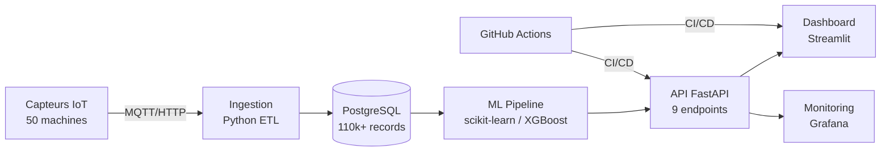

# MSPR 2 — MECHA : Maintenance Predictive Industrielle
## Support de Soutenance — Bloc 4 RNCP35584

> **Equipe** : Malek El Fayedh, Thibaut Doreau, Vincent Goncalves, Pierre-Louis Guinel  
> **Formation** : EPSI — Expert en Informatique et Systeme d'Information  
> **Date** : Mai 2026

---

## Slide 1 : Contexte MECHA

### L'entreprise
- **MECHA** : fabrication de pieces mecaniques haute precision
- **Secteurs** : aeronautique et automobile
- **5 usines** : Lyon, Toulouse, Nantes (France) + Barcelone, Madrid (Espagne)
- **50 machines** equipees de capteurs IoT

### Le probleme
- Maintenance **curative** uniquement (on repare quand ca casse)
- Couts d'arret non planifies estimes a **150k EUR/an par usine**
- Aucune capacite de **prediction** des pannes
- Pas de vision consolidee multi-sites

---

## Slide 2 : Objectif du projet

> **Developper une solution d'IA de maintenance predictive** capable de :

1. **Predire** les pannes machines avant qu'elles surviennent
2. **Estimer** la duree de vie restante (RUL) de chaque machine
3. **Detecter** les anomalies en temps reel
4. **Alerter** les equipes maintenance via un dashboard

### KPIs vises
| Indicateur | Avant | Objectif |
|-----------|-------|---------|
| Temps d'arret non planifie | ~12h/mois | < 4h/mois |
| Taux de pannes critiques | ~8% | < 3% |
| Precision des predictions | 0% | > 90% |

---

## Slide 3 : Collecte des besoins (C1)

### Methodologie
- **Entretien semi-directif** avec la Direction Industrielle MECHA
- Questionnaire structure en 6 axes :
  - Contexte actuel, problemes, attentes, contraintes, donnees, budget

### Besoins identifies

| Priorite | Besoin | Type |
|---------|--------|------|
| Must | Prediction de panne avec delai d'anticipation | Fonctionnel |
| Must | Dashboard temps reel par usine | Fonctionnel |
| Must | Alertes automatiques | Fonctionnel |
| Should | Estimation RUL par machine | Fonctionnel |
| Must | RGPD / EU AI Act | Non-fonctionnel |
| Must | Disponibilite > 99.5% | Non-fonctionnel |

> **Document** : `docs/client_interview.md`

---

## Slide 4 : Architecture technique (C2)



### Justification des choix

| Composant | Choix | Pourquoi |
|-----------|-------|---------|
| Langage | Python 3.11 | Ecosysteme ML, equipe competente |
| ML | scikit-learn + XGBoost | Interpretable, performant, EU AI Act |
| API | FastAPI | Async, auto-doc OpenAPI, validation Pydantic |
| Dashboard | Streamlit | Prototypage rapide, Python natif |
| BDD | PostgreSQL | Open source, robuste, extensible (TimescaleDB) |
| Conteneurs | Docker Compose | Reproductibilite, 4 services isoles |
| CI/CD | GitHub Actions | Integre, gratuit, pipeline lint+test+build |

> **Document** : `docs/architecture.md`

---

## Slide 5 : Donnees (Dataset hybride)

### Sources de donnees

| Source | Type | Enregistrements | Periode |
|--------|------|----------------|---------|
| **MECHA simule** | Capteurs IoT generes | 100 000 | Jan 2025 |
| **AI4I 2020** (UCI ML Repository) | Donnees reelles machine-outil | 10 000 | Mars 2025 |
| **Total fusionne** | **Hybride** | **110 000** | Jan-Avr 2025 |

### 12 features ML selectionnees
`temperature`, `vibration`, `humidity`, `pressure`, `energy_consumption`,
`predicted_remaining_life`, `temp_rolling_10min`, `temp_trend_1h`,
`vibr_rolling_10min`, `temp_std_30min`, `energy_vibr_ratio`, `downtime_risk`

### Precautions
- **machine_status EXCLUE** des features (data leakage)
- **Split temporel** 80/20 (pas aleatoire)
- **Desequilibre** gere : class_weight='balanced', scale_pos_weight

---

## Slide 6 : Modeles ML et resultats (C3)

### 5 modeles entraines

| Modele | Accuracy | Precision | Recall | F1 | AUC |
|--------|----------|-----------|--------|-----|-----|
| **Random Forest** | 98.4% | 98.8% | 62.1% | **76.3%** | 89.8% |
| **XGBoost** | 98.4% | 97.9% | 62.0% | **75.9%** | 90.5% |
| Regression Logistique | 90.5% | 27.3% | 79.2% | 40.6% | 86.8% |
| Isolation Forest | 74.7% | 9.5% | 59.7% | 16.3% | 77.4% |
| **RF Regressor (RUL)** | - | - | - | R2=**59.8%** | MAE=39 |

### Top features (importance)
1. `predicted_remaining_life` (37%) — degradation estimee
2. `downtime_risk` (20%) — score composite de risque
3. `temp_rolling_10min` (14%) — tendance temperature

> **Model cards EU AI Act** : `models/model_cards/`

---

## Slide 7 : Solution integree (C4)

### API REST — 9 endpoints

| Methode | Endpoint | Description |
|---------|----------|-------------|
| GET | `/health` | Healthcheck |
| POST | `/predict` | Prediction maintenance (1 machine) |
| POST | `/predict/batch` | Prediction batch (N machines) |
| POST | `/predict/rul` | Estimation duree de vie restante |
| POST | `/anomaly` | Detection d'anomalie |
| GET | `/metrics` | Metriques API et modeles |
| GET | `/model-info` | Info modeles + compliance EU AI Act |
| GET/PUT | `/alerts/config` | Configuration seuils d'alerte |

### Regles metier MECHA
- Temperature > 100C = **alerte critique**
- Taux de rebuts > 3% = **alerte critique**
- TRS < 75% = **alerte production**
- Human-in-the-Loop : l'operateur **decide** de l'intervention

---

## Slide 8 : Dashboard Streamlit (C3/C4)

### 5 vues metier

| Vue | Contenu |
|-----|---------|
| **Groupe** | KPIs globaux 5 usines, carte, comparatif |
| **Site** | Detail par usine, machines, tendances |
| **Machine** | Etat temps reel, RUL, prediction, historique |
| **Alertes** | Historique, filtres severite/usine, resolution |
| **Modele IA** | Performance, feature importance, matrice confusion |

### Design
- Theme sombre industriel
- Indicateurs couleur (vert/orange/rouge)
- Temps reel via API FastAPI

---

## Slide 9 : Tests et validation (C5)

### 100 tests automatises — tous OK

| Suite de tests | Nombre | Couverture |
|---------------|--------|------------|
| Tests API (pytest + httpx) | 61 | 9 endpoints, validation, edge cases |
| Tests qualite donnees | 19 | Structure, nulls, coherence metier |
| Tests modeles ML | 14 | Chargement, predictions, features |
| Tests integration | 6 | Workflow complet API + ML |
| **TOTAL** | **100** | **PASS** |

### Types de tests
- **Unitaires** : chaque endpoint, chaque modele
- **Integration** : API <-> modeles ML, scenarios normal vs critique
- **Recette** : scenarios metier (machine normale, machine critique, batch)

> **Document** : `docs/validation_plan.md`

---

## Slide 10 : Integration continue (C6)

### Pipeline GitHub Actions

```
push/PR sur main
    |
    v
 [Lint] -----> ruff check + format
    |
    v
 [Test] -----> pytest --cov (avec PostgreSQL)
    |
    v
 [Build] ----> docker build api + dashboard
```

### Docker Compose — 4 services

| Service | Image | Port | Healthcheck |
|---------|-------|------|-------------|
| **db** | postgres:15-alpine | 5432 | pg_isready |
| **api** | build ./api | 8000 | HTTP /docs |
| **dashboard** | build ./app | 8501 | HTTP /_stcore/health |
| **grafana** | grafana-oss:latest | 3000 | wget /api/health |

> **Fichier** : `.github/workflows/ci.yml`

---

## Slide 11 : Documentation utilisateur (C7)

### Guide utilisateur metier
- Redige pour un **responsable maintenance** (non technique)
- Explique : quoi, comment interpreter, limites
- Code couleur des indicateurs
- Procedure de reaction aux alertes
- FAQ (6 questions courantes)

### Contenu
> "Quand le voyant passe au rouge et que le RUL indique moins de 2 heures,
> planifiez une intervention dans les 30 minutes."

> **Document** : `docs/user_guide.md`

---

## Slide 12 : Conduite du changement (C8)

### 4 axes

| Axe | Actions |
|-----|---------|
| **Informer** | Newsletter projet, affichage usine, reunions info |
| **Communiquer** | COPIL mensuel, FAQ, gestion des resistances |
| **Former** | 3 sessions par profil (operateur, superviseur, direction) |
| **Faire participer** | Ambassadeurs par usine, co-construction, feedback |

### Outils utilises
- **FutureWheel** : anticiper les impacts en cascade
- **Modele de Bridge** : gerer les transitions (fin/zone neutre/renouveau)

### Deploiement progressif

| Phase | Usine | Duree |
|-------|-------|-------|
| Pilote | Lyon | 2 mois |
| Extension FR | Toulouse, Nantes | 3 mois |
| International | Barcelone, Madrid | 3 mois |

> **Document** : `docs/change_management.md`

---

## Slide 13 : Conformite reglementaire

### EU AI Act
- Systeme classe **risque limite** (aide a la decision, pas autonome)
- **Human-in-the-Loop** obligatoire et implemente
- **Model cards** pour chaque modele (transparence)
- Documentation des biais et limites

### RGPD
- Donnees **machines uniquement** (pas de donnees personnelles)
- PIA non necessaire en configuration actuelle
- Analyse d'impact documentee si ajout donnees operateurs (badges, shifts)

### Securite
- Conteneurs Docker isoles, utilisateur non-root
- CORS configure, validation Pydantic stricte
- Variables sensibles dans `.env` (jamais en dur)

> **Documents** : `docs/rgpd_analysis.md`, `models/model_cards/`

---

## Slide 14 : Livrables du projet

### Code source (GitHub)
- **50 fichiers**, ~41 000 lignes
- Repository : `github.com/HASHT85/MSPR2-MECHA`

### Structure

| Dossier | Contenu | Fichiers |
|---------|---------|----------|
| `api/` | FastAPI + tests + Dockerfile | 6 |
| `app/` | Streamlit dashboard + Dockerfile | 4 |
| `data/` | Scripts + dictionnaire + donnees | 6 |
| `models/` | Training + model cards + metriques | 12 |
| `docs/` | 8 documents de competences | 8 |
| `tests/` | Tests globaux (data + ML + integration) | 4 |
| racine | Docker, CI/CD, config | 6 |

---

## Slide 15 : Bilan et perspectives

### Ce qui fonctionne
- Pipeline ML complet et reproductible
- API fonctionnelle avec fallback gracieux
- 100% des tests passent
- Documentation couvrant les 8 competences
- Dataset hybride (simule + reel)

### Axes d'amelioration
- Deploiement reel sur infrastructure cloud (AWS/GCP)
- Integration de donnees live via MQTT/Kafka
- Ajout de modeles deep learning (LSTM) pour les series temporelles
- A/B testing entre modeles en production
- Migration vers TimescaleDB pour les time-series

### Conclusion
> La solution MECHA demontre qu'une approche **ML interpretable**
> (Random Forest, XGBoost) associee a une architecture **conteneurisee**
> et une **documentation complete** permet de repondre aux enjeux
> de maintenance predictive industrielle tout en respectant les
> contraintes reglementaires (EU AI Act, RGPD).

---

**Merci — Questions ?**
