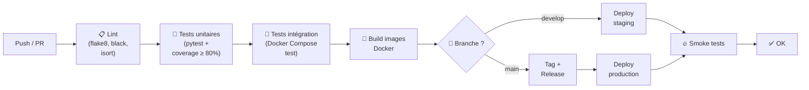
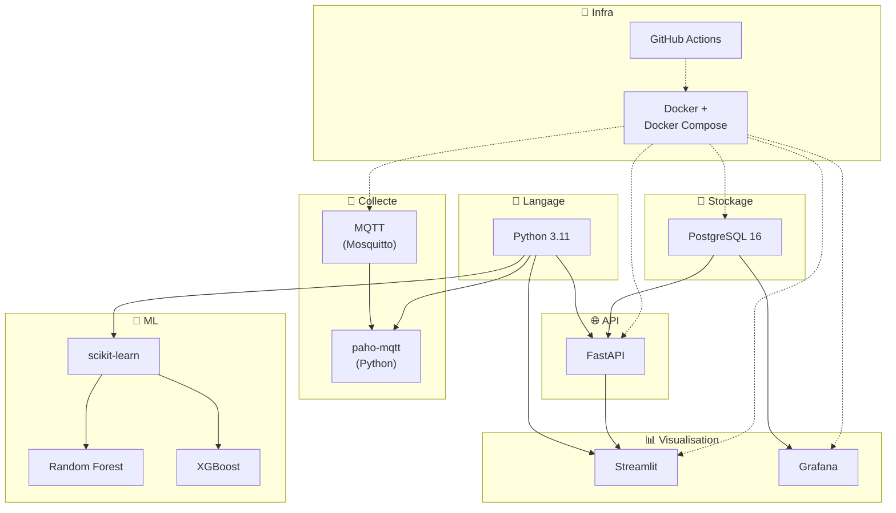

# 🔬 Justification des Choix Techniques — MECHA Predict

> **Projet** : MECHA — Maintenance Prédictive par Intelligence Artificielle  
> **Version** : 1.0  
> **Date** : 30/05/2026  
> **Auteurs** : Malek El Fayedh, Thibaut Doreau, Vincent Gonçalves, Pierre-Louis Guinel

---

## 1. Introduction

### 1.1 Objectif du document

Ce document justifie chaque choix technique de la stack MECHA Predict. Pour chaque composant, nous présentons les alternatives considérées, les critères de sélection et les raisons du choix final. Ce document s'inscrit dans la continuité des conclusions de la **MSPR 1** (état de l'art sur la maintenance prédictive).

### 1.2 Lien avec la MSPR 1

L'état de l'art réalisé en MSPR 1 a permis d'identifier :
- Les **algorithmes de ML** les plus adaptés à la maintenance prédictive industrielle
- Les **architectures techniques** déployées dans l'industrie 4.0
- Les **bonnes pratiques** en matière de collecte et traitement de données IoT
- Les **limites** des approches existantes (deep learning trop complexe, données insuffisantes)

Les choix techniques présentés ici sont directement guidés par ces conclusions.

### 1.3 Critères de sélection

| Critère | Description | Poids |
|---------|-------------|:-----:|
| **Maturité** | Stabilité, fiabilité, historique en production | 20% |
| **Communauté** | Documentation, support, écosystème de plugins | 15% |
| **Performance** | Vitesse, scalabilité, consommation de ressources | 20% |
| **Coût** | Licence, infrastructure, maintenance | 15% |
| **Compétences équipe** | Maîtrise par les membres de l'équipe projet | 20% |
| **Adéquation métier** | Pertinence pour la maintenance prédictive industrielle | 10% |

---

## 2. Langage de programmation — Python

### 2.1 Comparatif

| Critère | Python ✅ | R | Java | Julia |
|---------|:--------:|:-:|:----:|:-----:|
| Maturité | ⭐⭐⭐⭐⭐ | ⭐⭐⭐⭐ | ⭐⭐⭐⭐⭐ | ⭐⭐⭐ |
| Écosystème ML | ⭐⭐⭐⭐⭐ | ⭐⭐⭐⭐ | ⭐⭐⭐ | ⭐⭐⭐ |
| Écosystème Web/API | ⭐⭐⭐⭐⭐ | ⭐ | ⭐⭐⭐⭐ | ⭐⭐ |
| Performance brute | ⭐⭐⭐ | ⭐⭐ | ⭐⭐⭐⭐⭐ | ⭐⭐⭐⭐⭐ |
| Facilité d'apprentissage | ⭐⭐⭐⭐⭐ | ⭐⭐⭐⭐ | ⭐⭐⭐ | ⭐⭐⭐ |
| Communauté | ⭐⭐⭐⭐⭐ | ⭐⭐⭐ | ⭐⭐⭐⭐⭐ | ⭐⭐ |
| Compétences équipe | ⭐⭐⭐⭐⭐ | ⭐⭐ | ⭐⭐⭐ | ⭐ |
| Coût (licence) | Gratuit | Gratuit | Gratuit | Gratuit |

### 2.2 Justification

**Python** est le choix naturel pour ce projet car il est le **langage de référence en data science et machine learning**. Il permet de couvrir l'intégralité de la stack avec un seul langage :

- **Data engineering** : pandas, NumPy, SQLAlchemy
- **Machine learning** : scikit-learn, XGBoost
- **API** : FastAPI
- **Dashboard** : Streamlit
- **IoT** : paho-mqtt

**Pourquoi pas R ?** R excelle en statistiques et visualisation, mais son écosystème web/API est limité (Shiny vs FastAPI). Il aurait imposé un second langage pour l'API.

**Pourquoi pas Java ?** Java est performant et robuste, mais plus verbeux. L'écosystème ML Java (Weka, DL4J) est moins riche que celui de Python. Le temps de développement aurait été significativement plus long.

**Pourquoi pas Julia ?** Julia offre d'excellentes performances numériques, mais sa communauté est encore jeune et l'écosystème web/API est immature. Le risque de trouver peu de documentation et de support est trop élevé.

---

## 3. Framework Machine Learning — scikit-learn

### 3.1 Comparatif

| Critère | scikit-learn ✅ | TensorFlow | PyTorch | H2O.ai |
|---------|:--------------:|:----------:|:-------:|:------:|
| Maturité | ⭐⭐⭐⭐⭐ | ⭐⭐⭐⭐⭐ | ⭐⭐⭐⭐ | ⭐⭐⭐ |
| Modèles classiques (RF, XGB) | ⭐⭐⭐⭐⭐ | ⭐⭐ | ⭐⭐ | ⭐⭐⭐⭐ |
| Deep Learning | ⭐ | ⭐⭐⭐⭐⭐ | ⭐⭐⭐⭐⭐ | ⭐⭐⭐ |
| Facilité d'utilisation | ⭐⭐⭐⭐⭐ | ⭐⭐⭐ | ⭐⭐⭐ | ⭐⭐⭐⭐ |
| Interprétabilité | ⭐⭐⭐⭐⭐ | ⭐⭐ | ⭐⭐ | ⭐⭐⭐ |
| Taille des données | Moyen (RAM) | Très grande | Très grande | Grande |
| Temps de prototypage | ⭐⭐⭐⭐⭐ | ⭐⭐⭐ | ⭐⭐⭐ | ⭐⭐⭐⭐ |
| Documentation | ⭐⭐⭐⭐⭐ | ⭐⭐⭐⭐ | ⭐⭐⭐⭐ | ⭐⭐⭐ |

### 3.2 Justification

**scikit-learn** est le choix optimal pour MECHA Predict car :

1. **Modèles adaptés** : Random Forest et les modèles ensemblistes sont idéaux pour les données tabulaires industrielles
2. **Interprétabilité** : Les modèles sont explicables (feature importance), ce qui est crucial pour obtenir la confiance des équipes maintenance
3. **Rapidité de prototypage** : API unifiée (fit/predict/score) permettant d'itérer rapidement
4. **Volume de données compatible** : Avec ~50 machines et quelques mois d'historique, les données tiennent en mémoire
5. **Maturité exceptionnelle** : 15+ ans d'existence, API stable, excellente documentation

**Pourquoi pas TensorFlow/PyTorch ?** Le deep learning est surdimensionné pour notre cas d'usage. Nos données sont tabulaires (pas d'images, pas de séquences très longues). Les modèles seraient des « boîtes noires » difficiles à expliquer aux équipes maintenance. De plus, le deep learning nécessite beaucoup plus de données que nous n'en avons actuellement.

---

## 4. Algorithmes de prédiction — Random Forest + XGBoost

### 4.1 Comparatif

| Critère | Random Forest ✅ | XGBoost ✅ | LSTM | SVM | Régression logistique |
|---------|:---------------:|:---------:|:----:|:---:|:--------------------:|
| Performance (données tabulaires) | ⭐⭐⭐⭐ | ⭐⭐⭐⭐⭐ | ⭐⭐⭐ | ⭐⭐⭐ | ⭐⭐⭐ |
| Interprétabilité | ⭐⭐⭐⭐ | ⭐⭐⭐ | ⭐ | ⭐⭐ | ⭐⭐⭐⭐⭐ |
| Robustesse aux outliers | ⭐⭐⭐⭐⭐ | ⭐⭐⭐⭐ | ⭐⭐ | ⭐⭐ | ⭐⭐ |
| Gestion données manquantes | ⭐⭐⭐⭐ | ⭐⭐⭐⭐⭐ | ⭐⭐ | ⭐ | ⭐ |
| Volume de données requis | Moyen | Moyen | Très élevé | Moyen | Faible |
| Temps d'entraînement | Rapide | Rapide | Lent | Moyen | Très rapide |
| Complexité d'implémentation | Faible | Faible | Élevée | Moyenne | Très faible |
| Adapté séries temporelles | ⚠️ (avec features) | ⚠️ (avec features) | ✅ (natif) | ❌ | ❌ |

### 4.2 Stratégie à deux modèles

| Modèle | Rôle | Type | Sortie |
|--------|------|------|--------|
| **Random Forest** | Classification : « Risque de panne oui/non ? » | Classification binaire | 0 (normal) / 1 (panne imminente) + probabilité |
| **XGBoost** | Régression : « Dans combien d'heures ? » (RUL) | Régression | Nombre d'heures estimé avant panne |

### 4.3 Justification

#### Random Forest (classification de panne)

- **Robuste** : Résistant au surajustement grâce au bagging (agrégation de multiples arbres)
- **Interprétable** : Feature importance native → « la température est le facteur principal de cette alerte »
- **Peu de prétraitement** : Gère les features numériques sans normalisation
- **Fiable** : Très peu de risque de prédiction aberrante

#### XGBoost (estimation du RUL)

- **Performance supérieure** : Boosting gradient = optimisation itérative qui maximise la précision
- **Gestion native des données manquantes** : Important en contexte industriel (capteurs défaillants)
- **Régularisation intégrée** : Prévient le surajustement
- **Rapidité** : Très rapide en inférence, adapté au temps quasi-réel

#### Pourquoi pas LSTM (deep learning) ?

| Argument | Détail |
|----------|--------|
| **Données insuffisantes** | Le LSTM nécessite des milliers de séquences de panne pour apprendre. Avec ~50 machines et quelques mois d'historique, nous sommes très loin du compte. |
| **Boîte noire** | Le LSTM ne fournit pas d'explication native. « Pourquoi cette alerte ? » reste sans réponse exploitable pour un technicien. |
| **Complexité** | L'architecture LSTM (hyperparamètres, séquences, padding) est complexe à maintenir en production. |
| **Surcoût** | Nécessite potentiellement un GPU, augmentant le coût d'infrastructure. |
| **Évolution future** | Si le volume de données augmente significativement (> 2 ans d'historique), le LSTM pourra être envisagé en complément. |

---

## 5. Framework API — FastAPI

### 5.1 Comparatif

| Critère | FastAPI ✅ | Flask | Django REST | Express.js |
|---------|:---------:|:-----:|:-----------:|:----------:|
| Performance (req/s) | ~15 000 | ~5 000 | ~3 000 | ~12 000 |
| Documentation auto (Swagger) | ✅ Natif | ❌ Manuel | ✅ (DRF) | ❌ Manuel |
| Asynchrone | ✅ Natif (async/await) | ⚠️ Via extension | ⚠️ Via ASGI | ✅ Natif |
| Validation données | ✅ Pydantic (natif) | ❌ Manuel | ✅ Serializers | ❌ Manuel |
| Typage Python | ✅ Natif | ❌ | ✅ Partiel | N/A (JS) |
| Courbe apprentissage | Faible | Très faible | Moyenne | Faible |
| Taille framework | Léger | Très léger | Lourd | Léger |
| WebSocket | ✅ | ⚠️ Via extension | ⚠️ Via channels | ✅ |
| Langage | Python | Python | Python | JavaScript |

### 5.2 Justification

FastAPI est le choix idéal car :

1. **Performance** : Le plus rapide des frameworks Python, comparable à Node.js/Go
2. **Documentation automatique** : Swagger UI et ReDoc générés automatiquement depuis le code — indispensable pour une API de prédiction
3. **Validation Pydantic** : Validation native des entrées/sorties avec des modèles typés — réduit les bugs et facilite la maintenance
4. **Asynchrone natif** : Gestion efficace des requêtes concurrentes (important quand 50 machines interrogent l'API)
5. **Même langage que le ML** : Pas de sérialisation/désérialisation complexe entre le modèle ML et l'API

**Pourquoi pas Flask ?** Flask est plus simple mais n'offre pas de validation automatique ni de documentation Swagger native. Pour un prototype simple, Flask suffirait, mais pour une API de production exposant des modèles ML, FastAPI est supérieur.

**Pourquoi pas Django REST ?** Trop lourd pour notre besoin. Django inclut un ORM, un admin, un système de templates — autant de fonctionnalités inutiles pour une API de prédiction.

**Pourquoi pas Express.js ?** Imposerait un second langage (JavaScript) dans la stack, créant une rupture avec le pipeline ML en Python.

---

## 6. Dashboard / Visualisation — Streamlit + Grafana

### 6.1 Comparatif

| Critère | Streamlit ✅ | Dash | Metabase | Power BI | Grafana ✅ |
|---------|:-----------:|:----:|:--------:|:--------:|:---------:|
| Langage | Python | Python | No-code | No-code | No-code + config |
| Prototypage rapide | ⭐⭐⭐⭐⭐ | ⭐⭐⭐ | ⭐⭐⭐⭐ | ⭐⭐⭐⭐ | ⭐⭐⭐⭐ |
| Personnalisation | ⭐⭐⭐⭐ | ⭐⭐⭐⭐⭐ | ⭐⭐ | ⭐⭐⭐ | ⭐⭐⭐⭐ |
| Monitoring temps réel | ⭐⭐⭐ | ⭐⭐⭐ | ⭐⭐ | ⭐⭐⭐ | ⭐⭐⭐⭐⭐ |
| Alerting natif | ❌ | ❌ | ⚠️ Limité | ⚠️ | ✅ Natif |
| Connexion PostgreSQL | ✅ (via API) | ✅ | ✅ Natif | ✅ | ✅ Natif |
| Coût | Gratuit | Gratuit | Gratuit (OSS) | Payant | Gratuit (OSS) |
| Déploiement Docker | ✅ Simple | ✅ | ✅ | ❌ Cloud | ✅ |

### 6.2 Stratégie à deux dashboards

| Outil | Public cible | Usage | Justification |
|-------|-------------|-------|--------------|
| **Streamlit** | Équipe data, direction, responsables maintenance | Exploration données, analyse prédictions, gestion alertes, reporting | Prototypage Python ultra-rapide, interactivité, intégration native avec les modèles ML |
| **Grafana** | Opérateurs, techniciens maintenance | Monitoring temps réel des capteurs, alertes visuelles | Standard industriel du monitoring, rafraîchissement temps réel, alerting natif (email/Slack) |

**Pourquoi deux outils ?** Les besoins des utilisateurs sont fondamentalement différents. L'équipe data et la direction ont besoin d'**exploration et d'analyse** (Streamlit excelle). Les opérateurs terrain ont besoin de **monitoring temps réel avec alertes** (Grafana excelle). Un seul outil ne couvre pas les deux besoins de manière optimale.

---

## 7. Base de données — PostgreSQL

### 7.1 Comparatif

| Critère | PostgreSQL ✅ | MySQL | MongoDB | InfluxDB | TimescaleDB |
|---------|:------------:|:-----:|:-------:|:--------:|:-----------:|
| Type | Relationnel | Relationnel | Document (NoSQL) | Time-series | Time-series (ext. PG) |
| SQL standard | ✅ Complet | ✅ Partiel | ❌ (MQL) | ⚠️ (InfluxQL/Flux) | ✅ Complet |
| Séries temporelles | ⚠️ Correct | ⚠️ Faible | ⚠️ Faible | ✅ Excellent | ✅ Excellent |
| Relations complexes | ✅ | ✅ | ❌ | ❌ | ✅ |
| Support JSON | ✅ (JSONB) | ⚠️ Basique | ✅ Natif | ❌ | ✅ (JSONB) |
| Extensibilité | ⭐⭐⭐⭐⭐ | ⭐⭐⭐ | ⭐⭐⭐ | ⭐⭐ | ⭐⭐⭐⭐⭐ |
| Performance écriture | ⭐⭐⭐⭐ | ⭐⭐⭐⭐ | ⭐⭐⭐⭐⭐ | ⭐⭐⭐⭐⭐ | ⭐⭐⭐⭐⭐ |
| Performance lecture | ⭐⭐⭐⭐⭐ | ⭐⭐⭐⭐ | ⭐⭐⭐ | ⭐⭐⭐⭐ | ⭐⭐⭐⭐⭐ |
| Communauté | ⭐⭐⭐⭐⭐ | ⭐⭐⭐⭐⭐ | ⭐⭐⭐⭐ | ⭐⭐⭐ | ⭐⭐⭐ |
| Coût | Gratuit | Gratuit | Gratuit (Community) | Gratuit (OSS) | Gratuit (ext.) |

### 7.2 Justification

PostgreSQL est le choix optimal car :

1. **Polyvalence** : Gère à la fois les données relationnelles (machines, usines, utilisateurs) ET les données semi-structurées (JSON des capteurs)
2. **Extensibilité** : Possibilité d'ajouter **TimescaleDB** si les performances en séries temporelles deviennent insuffisantes — sans migration de base
3. **Maturité** : 35+ ans d'existence, fiabilité prouvée en production industrielle
4. **Conformité ACID** : Garantie d'intégrité des données — crucial pour la traçabilité (normes aéro)
5. **Connexion native Grafana** : Grafana se connecte nativement à PostgreSQL sans middleware
6. **Gratuit et open-source** : Pas de coût de licence, pas de vendor lock-in

**Pourquoi pas MongoDB ?** Nos données ont des relations fortes (machine → capteurs → mesures → prédictions → alertes → maintenances). Un modèle relationnel est plus adapté qu'un modèle document.

**Pourquoi pas InfluxDB ?** Excellent pour les séries temporelles pures, mais limité pour les requêtes relationnelles complexes. Aurait nécessité une deuxième base (PostgreSQL + InfluxDB), ajoutant de la complexité.

**Pourquoi pas TimescaleDB directement ?** TimescaleDB est une extension de PostgreSQL. Nous commençons avec PostgreSQL pur et pourrons activer TimescaleDB si les volumes l'exigent — c'est une évolution naturelle, pas un changement de technologie.

---

## 8. Conteneurisation — Docker

### 8.1 Comparatif

| Critère | Docker ✅ | Podman | VM (VirtualBox) | Kubernetes | Bare metal |
|---------|:--------:|:------:|:----------------:|:----------:|:----------:|
| Isolation | ⭐⭐⭐⭐ | ⭐⭐⭐⭐ | ⭐⭐⭐⭐⭐ | ⭐⭐⭐⭐⭐ | ⭐ |
| Légèreté | ⭐⭐⭐⭐⭐ | ⭐⭐⭐⭐⭐ | ⭐⭐ | ⭐⭐⭐⭐ | ⭐⭐⭐⭐⭐ |
| Portabilité | ⭐⭐⭐⭐⭐ | ⭐⭐⭐⭐ | ⭐⭐⭐ | ⭐⭐⭐⭐⭐ | ⭐ |
| Reproductibilité | ⭐⭐⭐⭐⭐ | ⭐⭐⭐⭐⭐ | ⭐⭐⭐ | ⭐⭐⭐⭐⭐ | ⭐⭐ |
| Orchestration multi-service | ✅ (Compose) | ✅ (Compose) | ❌ | ✅ (natif) | ❌ |
| Courbe d'apprentissage | Faible | Faible | Faible | Élevée | — |
| Communauté | ⭐⭐⭐⭐⭐ | ⭐⭐⭐ | ⭐⭐⭐⭐ | ⭐⭐⭐⭐⭐ | — |
| Adapté à notre échelle | ✅ | ✅ | ❌ (trop lourd) | ❌ (trop complexe) | ⚠️ |

### 8.2 Justification

Docker + Docker Compose est le choix idéal car :

1. **Reproductibilité** : Un `docker compose up` déploie toute la stack de manière identique en dev, staging et production
2. **Simplicité** : Fichier YAML unique pour orchestrer 6 services (API, BDD, Streamlit, Grafana, MQTT, ML worker)
3. **Isolation** : Chaque service est isolé dans son conteneur, évitant les conflits de dépendances
4. **Portabilité** : Fonctionne sur n'importe quel serveur Linux — essentiel pour le déploiement multi-sites
5. **Scalabilité future** : Migration possible vers Kubernetes si le besoin se fait sentir

**Pourquoi pas Kubernetes ?** Kubernetes est un orchestrateur puissant mais surdimensionné pour 50 machines et 5-6 services. La complexité d'administration (cluster, networking, RBAC K8s) n'est pas justifiée à ce stade. Docker Compose couvre largement nos besoins.

**Pourquoi pas des VM ?** Les VM sont plus lourdes (hyperviseur, OS complet par VM) et moins portables. Le déploiement et la mise à jour sont plus complexes.

---

## 9. CI/CD — GitHub Actions

### 9.1 Comparatif

| Critère | GitHub Actions ✅ | Jenkins | GitLab CI | CircleCI |
|---------|:----------------:|:-------:|:---------:|:--------:|
| Intégration Git | ✅ Natif GitHub | Via plugin | ✅ Natif GitLab | Via intégration |
| Configuration | YAML (simple) | Groovy (complexe) | YAML | YAML |
| Hébergement | SaaS (aucune infra) | Auto-hébergé (serveur) | SaaS ou self-hosted | SaaS |
| Coût (public) | Gratuit | Gratuit + coût serveur | Gratuit (400 min/mois) | Gratuit (limité) |
| Runners personnalisés | ✅ (self-hosted) | ✅ (agents) | ✅ (runners) | ⚠️ Limité |
| Marketplace d'actions | ⭐⭐⭐⭐⭐ | ⭐⭐⭐⭐ (plugins) | ⭐⭐⭐ | ⭐⭐⭐ |
| Secrets management | ✅ Natif | ✅ (Credentials) | ✅ Natif | ✅ Natif |
| Containers Docker | ✅ | ✅ | ✅ | ✅ |
| Matrix builds | ✅ | ⚠️ (complexe) | ✅ | ✅ |

### 9.2 Justification

GitHub Actions est le choix naturel car :

1. **Intégration native** : Le code est hébergé sur GitHub → pas de configuration de webhook ou d'intégration tierce
2. **Zéro infrastructure** : Pas de serveur Jenkins à maintenir, pas de mises à jour de sécurité
3. **Configuration YAML** : Simple, versionnable, lisible — un développeur junior peut la comprendre
4. **Marketplace riche** : Actions réutilisables pour Docker, pytest, linting, deployment
5. **Secrets intégrés** : Gestion native des clés API, mots de passe BDD, tokens

**Pourquoi pas Jenkins ?** Jenkins est puissant et flexible, mais nécessite un serveur dédié, une maintenance régulière (mises à jour Java, plugins), et une configuration en Groovy plus complexe. Pour une équipe de 4 personnes, c'est un overhead injustifié.

### 9.3 Pipeline prévu

---

## 10. Synthèse globale de la stack

### 10.1 Vue d'ensemble

### 10.2 Tableau récapitulatif

| Composant | Choix | Alternative principale | Raison du choix |
|-----------|-------|----------------------|-----------------|
| **Langage** | Python | R, Java | Écosystème ML + API unifié, compétences équipe |
| **Framework ML** | scikit-learn | TensorFlow, PyTorch | Modèles interprétables, prototypage rapide, données tabulaires |
| **Algorithme (classification)** | Random Forest | SVM, Régression logistique | Robuste, interprétable, peu de prétraitement |
| **Algorithme (régression)** | XGBoost | LSTM, SVR | Performance élevée, gestion données manquantes |
| **Framework API** | FastAPI | Flask, Django REST | Performance, doc auto, validation Pydantic |
| **Dashboard analytique** | Streamlit | Dash, Metabase | Prototypage Python, interactivité |
| **Monitoring temps réel** | Grafana | Kibana, Datadog | Standard industriel, alerting natif, connexion PG |
| **Base de données** | PostgreSQL | MongoDB, InfluxDB | Polyvalent, extensible (TimescaleDB), ACID |
| **Conteneurisation** | Docker + Compose | Kubernetes, VM | Simple, reproductible, adapté à notre échelle |
| **CI/CD** | GitHub Actions | Jenkins, GitLab CI | Intégration native GitHub, zéro infra, YAML |
| **Broker IoT** | MQTT (Mosquitto) | Kafka, RabbitMQ | Standard IoT, léger, fiable |

---

## 11. Lien avec la MSPR 1

### 11.1 Conclusions de l'état de l'art appliquées

| Conclusion MSPR 1 | Application dans MECHA Predict |
|-------------------|-------------------------------|
| Les modèles ensemblistes (RF, XGBoost) sont les plus performants sur les données industrielles tabulaires | ✅ Choix de Random Forest + XGBoost |
| Le deep learning (LSTM) nécessite un volume de données très important | ✅ Non retenu pour la V1, prévu comme évolution future |
| L'interprétabilité des modèles est un facteur clé d'adoption en industrie | ✅ Feature importance native des modèles choisis |
| Les architectures IoT modernes utilisent MQTT comme protocole standard | ✅ Choix de MQTT (Mosquitto) |
| La conteneurisation facilite le déploiement multi-sites | ✅ Docker + Docker Compose |
| La maintenance prédictive nécessite une phase pilote avant généralisation | ✅ Déploiement progressif (Lyon → France → Espagne) |

### 11.2 Évolutions possibles (guidées par l'état de l'art)

| Horizon | Évolution | Condition de déclenchement |
|---------|-----------|---------------------------|
| Court terme (6 mois) | **TimescaleDB** : extension PostgreSQL pour séries temporelles | Volume > 10 Go/mois |
| Court terme (6 mois) | **Redis** : cache pour les prédictions fréquentes | Latence API > 500ms |
| Moyen terme (12 mois) | **MLflow** : versioning des modèles ML | Plus de 3 modèles en production |
| Moyen terme (12 mois) | **Apache Kafka** : remplacement MQTT pour le streaming | Volume > 100 machines |
| Long terme (18+ mois) | **LSTM / Transformer** : deep learning si données suffisantes | > 2 ans d'historique, > 100 machines |
| Long terme (18+ mois) | **Kubernetes** : orchestration pour le multi-sites | > 10 sites ou microservices |

---

## 12. Limites et axes d'amélioration

### 12.1 Limites identifiées

| Limite | Impact | Mitigation |
|--------|--------|-----------|
| **Pas de deep learning** | Potentiellement moins performant sur les séquences longues | Prévu en évolution si données suffisantes |
| **Base centralisée** | Point unique de défaillance | Backup quotidien + buffer local |
| **Pas de MLOps** | Suivi manuel des modèles | MLflow prévu en phase 2 |
| **Streamlit = prototypage** | Interface moins « professionnelle » qu'une app custom | Suffisant pour la V1, refonte React possible en V2 |
| **Docker Compose ≠ Kubernetes** | Pas d'auto-scaling, pas de self-healing natif | Adapté à notre échelle, migration K8s possible |

### 12.2 Dette technique identifiée

| Élément | Risque | Plan de remédiation |
|---------|:------:|-------------------|
| Modèles ML sérialisés en fichiers (joblib) | Moyen | Migration vers MLflow (versioning, A/B testing) |
| Pas de monitoring applicatif (APM) | Faible | Intégration Prometheus + Grafana (métriques app) |
| Pas de queue de messages (async processing) | Faible | Redis Queue ou Celery si besoin de traitement différé |

---

> **Document validé par** : Équipe projet MECHA  
> **Prochaine révision** : Après la phase pilote (Lyon) — ajustement des choix si nécessaire
